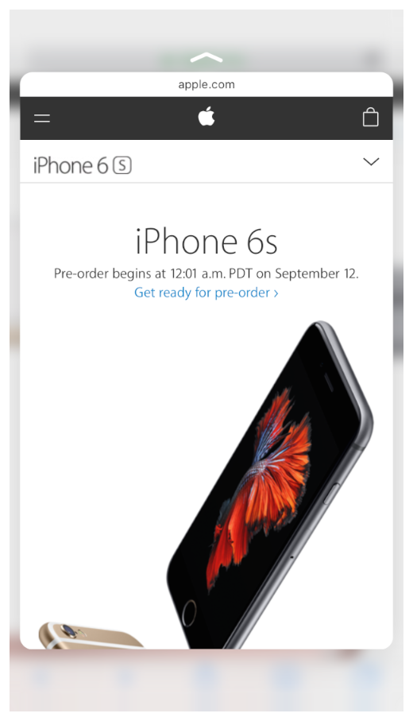
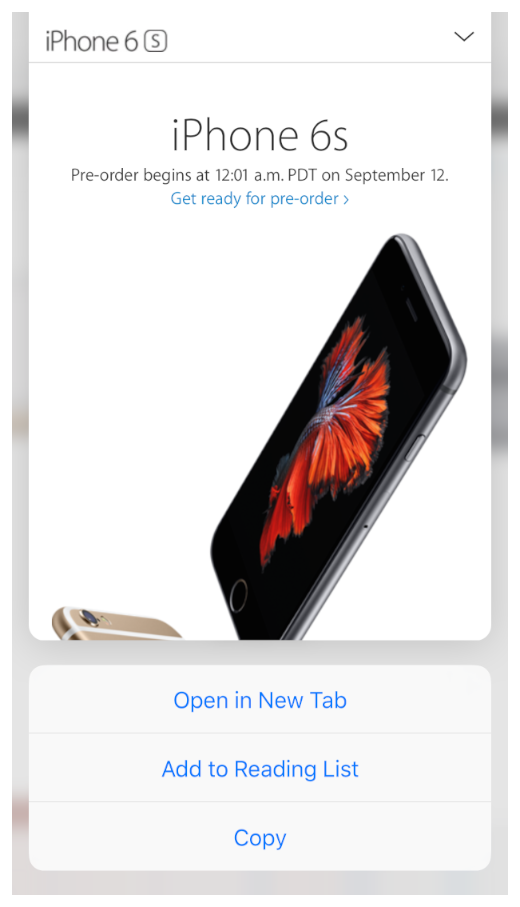
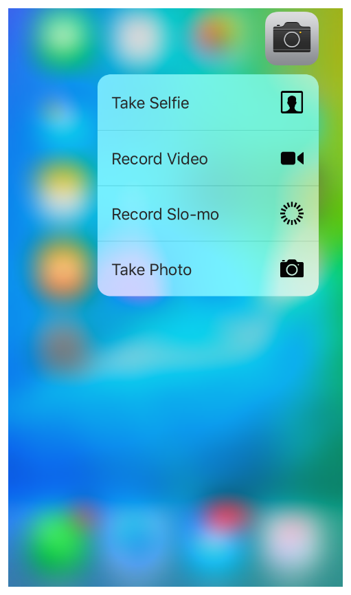
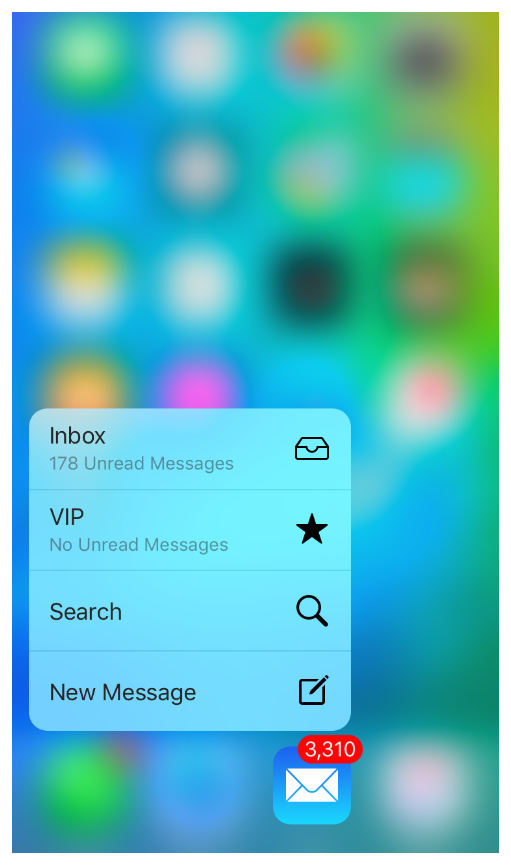
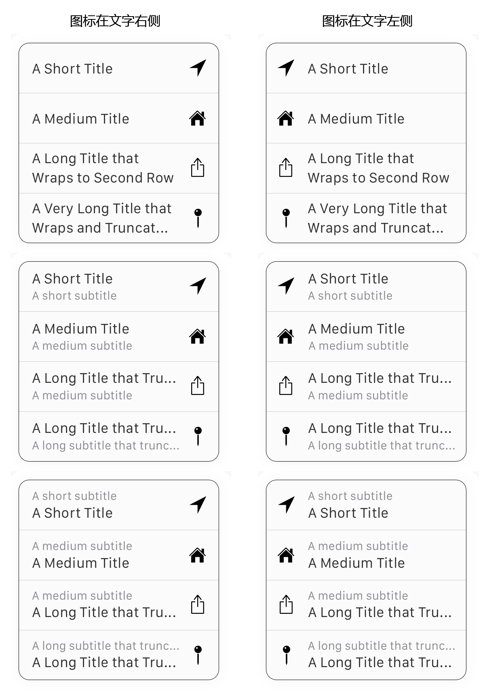

## 3.1 3D 触摸(3D Touch)
3D Touch 给 iOS 9 用户提供了一个新的交互维度。在所支持 3DTouch 的设备上，人们可以通过按压应用的图标去快速选择应用定制的操作。在应用内，人们可以使用多种按压操作去获取一个项目的预览，可以在独立的视图里打开一个项获取相关操作。(了解更多在你的代码中如何添加 3D Touch 支持，参阅 [Adopting 3D Touch on iPhone](https://developer.apple.com/library/ios/documentation/UserExperience/Conceptual/Adopting3DTouchOniPhone/index.html#//apple_ref/doc/uid/TP40016543).)

### 3.1.1 轻压和重压(Peek and Pop)
轻压让用户可以在不离开他们当前环境的情况下预览一个项和执行相关操作。支持轻压的该项会在轻压后给出一个小矩形视图作为反馈。

在 Safari 中的一个轻压视图

在 Safari 轻压中的快速操作

轻压(Peek)：

- 当用户按压在一个支持轻压的项上时出现轻压，用户手指抬起后会消失
- 当用户在轻压视图下再更加重一点的按压称之为重压，重压可以查看该项的详细视图
- 当用户在轻压视图中向上滑动，可以提供与该项相关的快速操作
当用户轻轻按压在屏幕，支持轻压的这个项会展示一个你提供的矩形视图，示意可以进行下一步交互操作。那个视图应该够大，这样才能让用户手指不会混淆内容，这个视图应该足够细节，这样可以让用户选择是否去更加重一点按压从而转换到轻压视图。

重要

你在应用中始终如一提供轻压和重压的体验是至关重要的。如果你在有些地方支持轻压和重压，在某些地方不支持，用户有可能认为你的应用或者他们的设备出现了问题。

**使用轻压去为该项提供一个生动的，内容丰富的预览。**当轻压能够给用户提供关于该项的足够信息，从而帮助他们扩展当前的任务，这样做是最好的。例如，在用户决定好是在 Safari 中打开信息中的网页还是分享这个链接给朋友之前，用户可以使用轻压预览信息中 URL 的页面。在表单视图中，轻压可以给用户提供一个行项的详细内容。

**为每个轻压提供重压。**虽然一个轻压可以提供给用户所需要的大部分信息，但是你应该可以让用户过渡到重压，从而让用户放开当前正在进行的任务，转移专注力到该项上来。重压的内容应该与用户点击该项后的内容一致。

**不要为同样一个项授予轻压和编辑菜单(Edit menu)两个功能。**当同一个项的这两个功能都启用的时会很混乱。(获取更多编辑菜单信息，参看 [Edit Menu](https://developer.apple.com/library/ios/documentation/UserExperience/Conceptual/MobileHIG/EditMenu.html#//apple_ref/doc/uid/TP40006556-CH46-SW1).)

**在轻压操作里，避免展现类似按钮的界面元素。**如果用户抬起手指去点击像按钮的元素，轻压会消失。

**如果可能，提供轻压快捷操作。 **在轻压里，用户可以向上滑动去显示该项的相关操作。例如，Mail 里的轻压快捷操作包括回复全部，转发和删除信息。并不是每个轻压都需要快捷操作，但是如果你已经为该项提供定制的点击并长按的操作，那么最好在轻压里提供相同的操作从而替代点击并长按操作。(注意在网页视图中，轻压快速操作是自动提供的。)

**不要将轻压作为唯一开启该项的指定操作的方式。**不是每一个设备都支持轻压和重压，一些用户可能选择关掉 3D Touch, 因此在你的应用中去寻找其他方式实现轻压的功能是非常重要的。当你的应用在较旧的设备上运行时，可以把轻压的快捷操作映射到一个视图里，让用户通过点击并长按获得。

### 3.1.2 主屏幕快捷操作(Home Screen Quick Actions)
主屏幕快捷操作可以在主屏幕给用户呈现方便的、有用的、应用特定的操作。

Camara 的主屏幕快捷操作

Mail 的主屏幕快捷操作

主屏幕快捷操作：

- 当用户在主屏幕采用比点击且长按更重的按压，按压在应用图片上时，出现屏幕快捷操作
- 它会显示一个你提供的短标题，一个图标和可选的副标题
- 它不支持其他定制的内容
- 它可以随着你应用的更新，更新显示的信息
**使用主屏幕快捷操作去开启引人注目的、高价值的任务。**例如，Maps 可以让用户不需要打开 Maps，通过在当前位置附近搜索就可以获得回家的方向。一个应用至少需要把一个有用的任务放在主屏幕快捷操作里；你可以提供最多四个快捷操作。

**避免使用主屏幕快捷操作去减少应用里导航的内容。**如果用户访问你应用的重要区域非常困难和耗时，那么首先去修改你的应用的导航，这样做是可以让所有用户都获益的。接着，可以去为有用的深层次链接提供主屏幕快捷操作，从而开启这些有用的、创造性的任务。

**不要把主屏幕快捷操作作为通知用户的一种方式。**iOS 用户期望以其他方式接收应用中的信息(更多信息参看 [Notifications](https://developer.apple.com/library/ios/documentation/UserExperience/Conceptual/MobileHIG/NotificationCenter.html#//apple_ref/doc/uid/TP40006556-CH39-SW1))。

**为主屏快捷操作提供一个简洁的标题(可有副标题)和一个模板的图标。**标题应该直接传达这个操作的结果；例如，“回家的方向”，“新建联系人”，和“新建信息”。你也可以提供一个副标题给用户更多上下文信息。例如，Mail 使用一个副标题在主屏快捷操作的重要位置去告诉用户有未读信息。 不要把你的应用名字或者无关的信息放在标题和副标题里，同时要考虑到使用本地化的用语。

保持标题的简洁不会被切断从而帮助用户快速理解操作是非常重要的。如果你提供的副标题一行显示不全，系统会截断；如果你没有副标题，系统会把一行展示不完全的长标题以两行展现。

你可以从很多系统提供的模板图标中选择图标，你也可以创作定制的模板图标。更多关于图标尺寸、内边距和定位的详细引导信息，可以下载主屏快速操图标模板 https://developer.apple.com/design/downloads/Quick-Action-Guides.zip。更多关于设计模板图标的信息，参看 [Template Icons](https://developer.apple.com/library/ios/documentation/UserExperience/Conceptual/MobileHIG/BarIcons.html#//apple_ref/doc/uid/TP40006556-CH21-SW1)。

系统会自动安排图标在快速操作列表中的位置是在左侧或者在右侧，这依赖于你的应用的图标在用户主屏幕的位置。(摒除图标在列表中的位置，在自左向右的语言中文字总是左对齐。)这里有主屏快捷操作的多种展现方式的例子。

