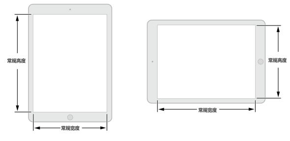
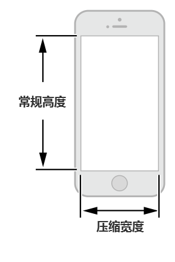
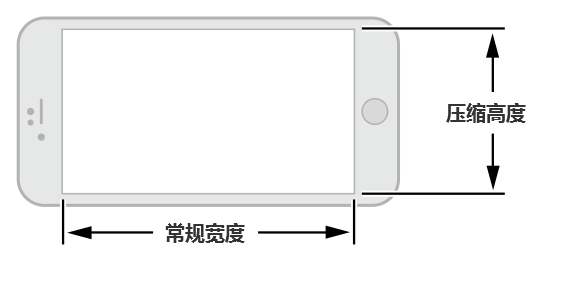
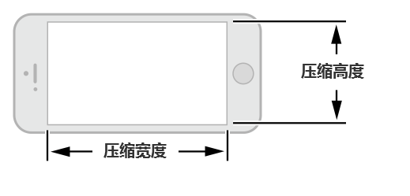
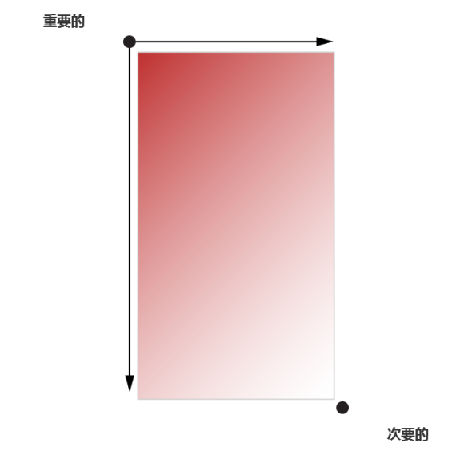
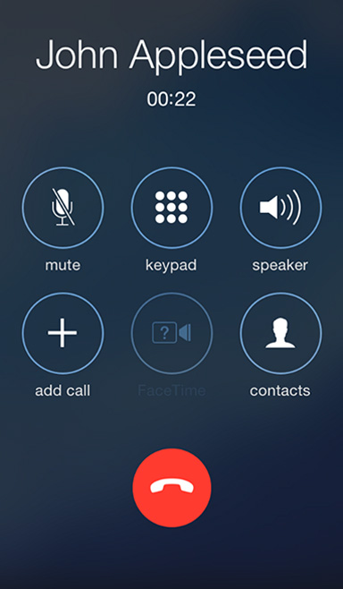
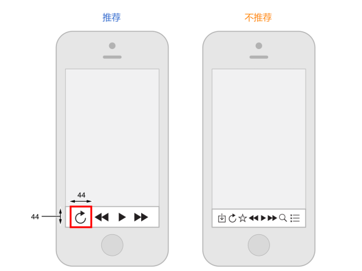

## 1.3 适应性和布局(Adaptivity and Layout)
### 1.3.1 为自适应而开发(Build In Adaptivity)

人们通常希望在他们所有的设备和多种情境中使用自己喜欢的应用程序，比如在不同的设备方向上和 iPad 的分屏情况下。尺寸类别(Size classes)和自动布局(Auto Layout)可以通过定义屏幕的布局、视图控制器和视图在环境变化时候应该怎么适应来帮助你实现这个愿望。(显示环境[display environment]的概念指的是设备的整个屏幕或者其中一部分，比如弹出框的区域或者 iPad 分屏视图中其中一侧的区域。)

iOS 在特征集合(trait collection)的定义中包含了显示环境的概念，特征集合囊括了尺寸类别(size class)，显示比例(display scale)和用户界面语言(user interface idiom)。你可以使用一个特征集合让你的视图和视图控制器响应显示环境的变化。

iOS 定义了两个尺寸类别(size class)，常规的(regular)和压缩的(compact)。常规尺寸与拓展的空间紧密相关，压缩尺寸与约束的空间相关。想要定义一种显示环境，你需要定义一种横屏尺寸类别，与一种竖屏尺寸类别。如你所想，一个 iOS 设备在竖屏模式可以使用一套类别，而横屏模式下可以使用另一套类别。

iOS 能随着尺寸类别和显示环境变化而自动生成不同布局。举个例子，当垂直尺寸从压缩变为常规时，导航栏和工具栏会自动变高。

当你靠尺寸类别来驱动布局变化时，你的应用在任何显示环境时都能显示得很好。关于如何在 Interface Builder 中更好的使用尺寸类别，你可以查阅 [Size Classes Design Help](https://developer.apple.com/library/ios/recipes/xcode_help-IB_adaptive_sizes/_index.html#//apple_ref/doc/uid/TP40014436).

注：在一种尺寸类别中，持续使用 Auto Layout 进行小的布局调整，比如拉伸或压缩内容。更多 Auto Layout，参看 [Auto Layout Guide](https://developer.apple.com/library/ios/documentation/UserExperience/Conceptual/AutolayoutPG/index.html).

下面的实例可以帮助你形象展现尺寸类型如何适配不同设备的显示环境。例如：iPad(包括 iPad Pro)在长宽和横屏竖屏时都使用常规尺寸类型。换句话说，iPad 显示环境一直处于垂直和水平的常规状态。

注：合格的 iPad 型号支持多任务，你的应用可能需要与其他应用共享同一个屏幕。确保使用 Auto Layout，这样你可以在用户使用多任务功能时响应他，比如 分屏模式(Split View)和多任务分屏模式(Slide Over)。

除了使用 Auto Layout，当你在 iPad Pro 上展示可读性的内容时，依靠 UIView 的  readableContentGuide 属性是非常重要的，这样可以拥有让读者舒服的边距。

iPhone 的显示环境可根据不同的设备和不同的握持方向而改变。

竖屏时，iPhone6 Plus 使用的是压缩宽度和常规高度类型。

横屏时，iPhone6 Plus 使用的是常规宽度和压缩高度类型。

其他 iPhone 型号，包括 iPhone6 使用相同的尺寸类型设置。

竖屏时，iPhone 6，iPhone 5 和iPhone 4S 使用的是压缩宽度和常规高度。

横屏时，这些设备在宽高上使用的都是压缩类。

### 1.3.2 在不同环境提供良好体验(Provide a Great Experience in Each Environment)
当你使用自适应来开发 UI 时，你可以保证UI跟随显示环境变化而适当地响应。遵照这些指南，你可以给用户良好的设备响应体验。

**在所有环境下都保持对主体内容的专注。**这是最高优先级。人们使用应用时，浏览感兴趣的内容并与之发生互动。随着环境变化改变专注点会让用户感觉到迷失方向，让他们感觉对应用失去控制。

**避免布局上不必要的变化。**在所有环境中保持一致的使用体验，能让人们在旋转设备或在不同设备上运行你的应用时维持稳定的使用模式。例如，如果你在水平的常规模式下使用了网格来显示图像，那么无需在压缩模式下使用列表来展示同样的内容，虽然你可能调整了网格的尺寸。

**如果你的应用只在一个方向上运行，那么请直接一点。**人们希望在各种握持方式下都可以使用你的应用，能满足这个期待是最好的。但是，如果你的应用只在一个方向下运行，那么你应当注意：

- **避免出现提示人们旋转设备的相关 UI 元素。**让应用在支持的方向下清晰地运行，如果需要用户旋转设备，不要给UI添加不必要的混乱。
- **支持同一个方向上的变化。**例如，如果一个应用只能横屏运行，用户无论用左手或是右手握持时都能触及到 home 键。如果用户在使用应用时180度旋转设备，那最好应用内容也能及时响应并旋转180度。

**如果你的应用将设备方向翻转视为用户输入(的一种指令)，那么就按照程序设定的方式来响应设备翻转。**举个例子，一个游戏让用户利用设备翻转来移动游戏中的部件，那么这个游戏应用本身(的 UI)不能对翻转屏幕产生响应。在这种情况下，你必须关联两个需要变化的方向，并且允许人们在这两个方向切换直到他们开始(了解并执行)应用的主体任务。一旦人们开始执行主要任务，那就开始按程序设定的那样来响应设备的动作。

### 1.3.3 使用布局来沟通(Use Layout to Communicate)
布局包含的不仅仅是一个应用屏幕上的UI元素外观。你的布局，应该告诉用户什么是最重要的，他们的选择是什么，以及事物是如何关联起来的。

**强调重要内容或功能，让用户容易集中注意在主要任务上。**有几个比较好的办法是在屏幕上半部分放置主要内容——遵循从左到右的习惯——从靠近左侧的屏幕开始：

**使用不同的视觉化重量和平衡来告诉用户当前屏显元素的主次关系。**大型控件吸引眼球，比小的控件更容易在出现时被注意到。而且大型控件也更容易被用户点击，这让它们在应用中尤其有用——就像电话和时钟(上面的按钮)那样——能让用户经常在容易分心的环境下仍然保持正常使用。

**使用对齐来让阅读更舒缓，让分组和层次之间更有秩序。**对齐让应用看起来整洁而有序，也让用户在滑动整屏内容时更容易定位和专注于重要信息。不同信息组的缩进与对齐让它们之间的关联更清晰，也让用户更容易找到某个控件。

**确保用户在内容处于默认尺寸时便可清楚明白它的主要内容与含义。**例如，用户应当无需水平滚动就能看到重要的文本，或不用放大就可以看到主体图像。

**准备好改变字体大小。**用户期望大多数应用都可以响应他们在 iOS 的设置中设定的字体大小。为了适应一些文本大小的变化，你也许需要调整布局；想要得到更多文本显示相关的信息，请查阅下文“颜色与字体”中相关的内容。

**尽量避免 UI 上不一致的表现。**在一般情况下，有着相似功能的控件看起来也应该类似。用户常常认为他们看到的不同总有原因，而且他们倾向于花时间去尝试(译者按：因此为了避免用户做无用的尝试，建议类似的功能外观都保持一样。)

**给每个互动的元素充足的空间，从而让用户容易操作这些内容和控件。**常用的点按类控件的大小是44 x 44点(points)。

