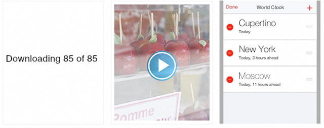

## 1.8 动画(Animation)
细微、精美的动画遍布 iOS 的用户界面，他们使应用的体验更具吸引力，更具动态性。适当的动画可以：

- 传达状态和提供反馈
- 增强直接的操纵感
- 将用户的操作可视化

(译者注：以上为视频截图，完整视频请点击观看)

**谨慎地增加动画，特别是在那些无法提供沉浸式体验的应用中。**过多和无理由的动画会阻碍应用的流畅性，降低性能，还会分散用户在操作中的注意力。

尤其是要有目的地，合理地应用动效和 UIKit 中的动态控件，并确保对结果进行测试。合理地使用动效可以提升用户的理解程度和愉悦感；应用过度使用动效会给用户带来迷惑和难以掌控的感觉。

**如果可以，保持自定义动画和内置动画的一致性。**用户习惯于内置 iOS 应用使用的精细动画。事实上，用户倾向于把视图之间的平滑切换，对设备方向改变的流畅相应和基于物理的滚动效果看做是 iOS 体验的一部分。除非，你的应用要给用户提供类似游戏应用的沉浸式体验，这种情况下自定义的动画可以区别于内置动画。

**使用风格类型一致的动画。**自定义动画之间也需要保持一致性，这样可以让用户在使用应用以之前建立的经验为基础。

**一般来说，自定义的动画要考虑动画的现实性和可信性。**人们乐意接受自由的艺术创作，但是当动效不合理或者违反物理学时，用户会感到困惑。例如，当你从屏幕顶部下滑拖出一个视图的时候，你也要上滑将它收起，因为这么做可以帮助用户记住这个视图从何而来。如果你下滑到屏幕底部关闭这个视图，用户关于从屏幕上方呼起的心理模型就会被打破。