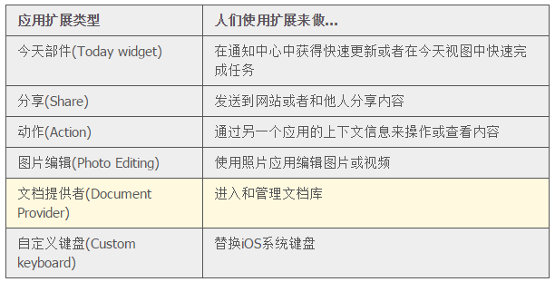
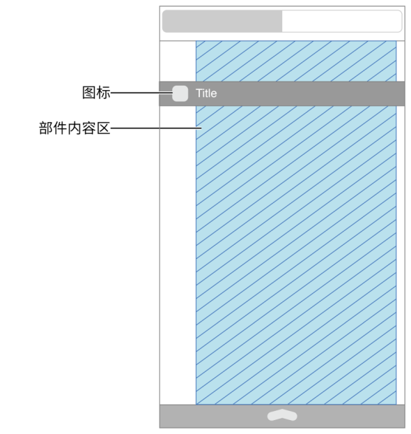
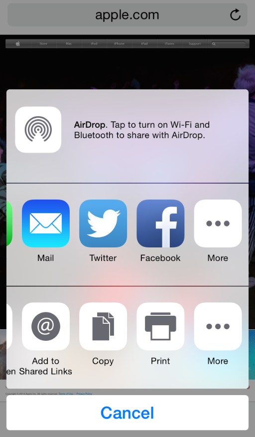
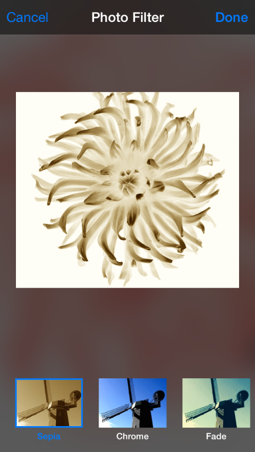
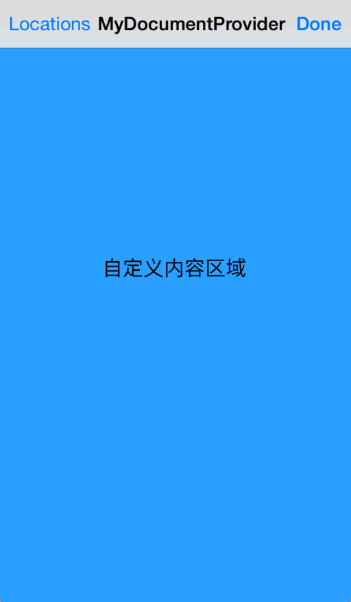

## 3.6  应用扩展(App Extensions)
应用扩展可以延伸应用的使用范围。当用户使用其他应用时，应用扩展使得用户仍能使用你应用的核心功能。举个例子，当人们在 Safari 中浏览网页时，他们可以使用你的分享扩展来发送一张图片或一篇文章到你的社交网站上。或者当使用 Photos(照片)应用时，人们可能会使用你的图片编辑扩展来为一张图片加上一个滤镜效果。(在这些场景中，Safari 和照片应用承载用户使用扩展的场景，因而被称为**宿主应用(host apps)。**)

你需要提交包含应用扩展的完整 iOS 应用到 App Store(包含扩展的应用被称为**容器应用(containing app)**)。在你的容器应用中启用扩展之后，人们就可以在使用其他应用时，使用扩展来执行快速任务。例如，在邮件中浏览某个商品时，人们可以不用离开邮件应用就使用你的动作扩展来把商品添加到购物清单中。 表 22-1 列举了可以多个创建的 iOS 应用扩展类型。

以下指南适用于所有类型的应用扩展，针对特定类型应用扩展的指南请参阅后续章节。(如果想了解如何开发、调试和发布一个扩展，请参阅 [App Extension Programming Guide](https://developer.apple.com/library/ios/documentation/General/Conceptual/ExtensibilityPG/index.html#//apple_ref/doc/uid/TP40014214).)

**确保是单任务。**应用扩展并不是应用的精简版，它帮助用户在有全局目标的上下文中完成狭义范围内的有限任务。例如，动作扩展可以为用户提供一种不同的方式来查看当前内容。

**保证用户的交互是有限和流畅的。**好的应用扩展应该只需几步点击就可以帮助人们完成任务，这样他们就能尽快回到之前的场景中。例如，分享扩展只需一次点击即可完成一张图片的分享。

**将容器应用及其应用扩展的名称保持一致。**一个容器应用中如果有多个扩展，需要使用不同的名称，你需要确保用户能够理解你的扩展和应用之间的关系。人们会在很多不同的情况下遇到扩展，如果他们当下没有认出来，那么他们就未必会信任这些扩展。

**大部分情况下，复用容器应用的图标。**显示用户熟悉的图标是获得用户信任的另一种方式。请注意，对于动作扩展来说，你应该使用单色版本的容器应用图标(详见[分享和动作扩展](https://developer.apple.com/library/ios/documentation/userexperience/conceptual/mobilehig/AppExtensions.html#//apple_ref/doc/uid/TP40006556-CH67-SW3))。

重要：和设计图标和图形一样，不要重复使用 iOS 的图标和图片，不要为苹果的产品和设计再设计一套图片。

**避免在扩展上显示模态视图。**很多扩展默认以模态视图来显示，所以应避免再叠加模态视图。尽管有时候用户可能会在扩展上遇到警告框，但是在设计扩展的流程时，应避免出现模态视图。

### 3.6.1 今天部件(Today Widgets)
人们会在通知中心的今天区域中查看今天部件(Today widgets)。因为人们会设置今天区域以显示他们最关注的信息，所以在此进行设计可以有效帮助你的部件在这些用户最重要的信息中占据一席之地。

**设计与通知中心风格一致的外观。**当使用通知中心的默认边距和背景时，你的今天部件就会给用户以统一的体验。为获得最佳的结果，你应该重点关注你的内容而不是背景或者其他的，尤其应该避免绘制一片纯色背景。

注意：

iOS 会自动在自定义的部件内容上方显示应用的图标和标题(图标会显示在标题前面的空白处)。

**将部件内容与标题对齐。**当你的部件内容与标题对齐时，人们就可以很简单地浏览今天视图中他们想要的部件。遵守今天视图中的边距规范，并将内容约束在如图的部件内容区内。

 **一般情况下，使用白色的系统字体来显示文本。**在通知中心默认背景下白色文字会看起来较好。对于二级文本，可以使用系统提供的 vibrant 外观样式(查看 [notificationCenterVibrancyEffect](https://developer.apple.com/library/ios/documentation/UIKit/Reference/UIVibrancyEffect/index.html#//apple_ref/occ/clm/UIVibrancyEffect/notificationCenterVibrancyEffect)了解更多)。

**提供通知中心式的体验。**人们访问通知中心来获取简要的更新或者执行一个非常简单的任务，所以今天部件最好只显示适量的信息和进行有限的互动，特别是：

- 避免用户在部件中需要滚动或纵向移动来查看全部的信息。部件可以通过纵向扩展来显示更多的信息，但若部件的高度超过通知中心的高度就不是一种好的体验了，因为这样会干扰其他部件的查看
- 避免使用横向扫动或拖曳，因为这会干扰在通知中心进行导航
- 尽可能使用户只需一步操作就完成任务或打开你的应用(注意，在今天部件中键盘是不可用的)
- 优化性能以便人们可以即刻获得有用的信息。可以考虑在本地缓存信息，以便当有更新时就可显示最近信息。人们只希望在今天视图中花很少的时间，如果部件使用内存不当，iOS 就可能会终止它
**在适当情况下，让人们点击你的今天部件来打开你的应用。**因为今天部件提供了专一的体验，所以就能有效引导人们去到你的应用以获取更多信息或功能。最好不要显示“打开应用”按钮，而是应该让你的整个今天部件都可被点击来打开应用。你也可以让用户点击部件中的UI对象，以打开你的应用并跳转到关于此UI对象的视图中。举个例子，日历部件显示了今天的事件，如果用户想要获得某个事件的更多信息，他们可以点击部件中的事件来打开日历应用进行查看。

注意：

虽然从部件打开应用的方式对用户来说还不错，但继续在部件中提供有用且及时的信息依然是很重要的。人们可不一定会欣赏一个功能只是打开应用的今天部件。

如果可能，在今天部件中让人们知道他们需要登录来获取有用的信息。如果你的今天不见需要人们登录查看信息，展示一个信息去鼓励他们登录和解释什么样的内容将会被呈现。例如，如果你的时间部件即将到来的预约是用户登录后展现的，你可能需要让用户“登录我的应用去查看即将到来的预约”。

不要制作一个今天不见需要打开除了你自己应用外的应用。一个模拟 iOS 主屏的行为的时间部件不会为你的用户提供有用的功能。

### 3.6.2 分享和动作扩展(Share and Action Extensions)
人们通过点击应用中的动作按钮(Action button)来使用分享和动作扩展。在通过动作按钮显示的动作视图控制器(activity view controller)中，动作扩展被列在底部，分享扩展被列在动作扩展之上。人们可以使用更多（More）按钮来管理显示在动作视图控制器中的分享和动作扩展。

分享或动作扩展通常被认为是在当前用户场景下用来输入内容之用。例如，当在 Safari 中阅读一篇文章时，用户可能会点击动作按钮并使用一个分享扩展来发送这篇文章到分享网站上，也可能会使用一个动作扩展来查看这篇文章的翻译。

注意：

在动作视图控制器中，iOS 只会显示支持当前内容类型的动作扩展。例如，当用户当前内容是视频时，iOS 就不会显示支持文本的动作扩展。

**尽可能在分享扩展中使用系统提供的 UI。**系统所提供的撰写视图控制器 (compose view controller) 提供给用户一种一致的体验，并能自动支持一些常用任务，例如预览和确认标准项，同步内容，查看动画，以及完成一封邮件。欲知更多关于使用系统提供的撰写视图控制器，请参见 [App Extension Programming Guide](https://developer.apple.com/library/ios/documentation/General/Conceptual/ExtensibilityPG/index.html#//apple_ref/doc/uid/TP40014214) 中的 [Share](https://developer.apple.com/library/ios/documentation/General/Conceptual/ExtensibilityPG/ShareSheet.html#//apple_ref/doc/uid/TP40014214-CH12).

**如果上传需要一定时间，那就应考虑在分享扩展的容器应用中显示上传进度。**无论分享的文件有多大，人们都期待在点击扩展中的发送或分享按钮后，能立即返回他们之前的场景。你需要让进度状态随时更新，但是人们不想每次上传完毕后都收到通知，并且也无法自动重启扩展。在这种场景下，在容器应用中显示上传进度是一种解决方案，这样容器应用就可以在后台处理任务，并在遇到问题时发送通知。

**动作扩展使用单色的应用图标。**( 不同的是，分享扩展则应该使用其容器应用的彩色应用图标。) 要为动作扩展设计图标时，你可能需要从创建一个应用图标的模版开始着手。如有需要，可以专注图标所特有的元素来进行简化设计。

如果你在容器应用中提供了多个动作扩展，那么最好为他们设计一套图标，且确保这套图标中的每一个看起来都与容器应用的图标是有关联的。

### 3.6.3 图片编辑扩展(Photo Editing Extensions)
当人们在照片(Photos)中查看图片或视频时，可以使用图片编辑扩展。一般来说，图片编辑扩展能帮助用户筛选图片或进行一些其他的图片或视频编辑。在用户确认之后，编辑后的内容就会出现在照片应用中。

照片应用提供了一个模态视图来显示图片编辑扩展的自定义 UI。当用户在确认对图片或视频的编辑时选择了取消(你必须要在代码上保证存在这个行为)，照片应用还可以显示一个确认视图。

**避免在图片编辑扩展中使用导航栏。**如图所示，承载扩展的模态视图已经包含了导航栏，若再增加另一个导航栏，既会占据更多你的界面空间，还会使用户产生困扰。(照片应用默认会以全屏高度来显示你的视图，所以你的内容会出现在内建的导航栏之下。)

**如果可以，让用户能够预览编辑结果。**尽可能让用户在关闭扩展返回照片应用之前看到他们编辑的成果。

### 3.6.4 文档提供者扩展(Document Provider Extensions)
文档提供者扩展帮助人们在其他各种应用中查阅你的应用所管理的文档。在宿主应用(host app)中，文档采集视图控制器(document picker view controller)会显示你的扩展所提供的UI(想要了解更多有关文档采集视图控制器的内容，请查阅 [UIDocumentPickerViewController Class Reference](https://developer.apple.com/library/ios/documentation/UIKit/Reference/UIDocumentPickerViewController_Class/index.html#//apple_ref/doc/uid/TP40014342)).

注意：

文档提供者扩展由两个不同的部分组成：文档采集视图控制器扩展和文件提供者扩展。文档采集视图控制器扩展包括了你的自定义 UI，文件提供者扩展实现对文件的访问。为了简单起见，本节所使用的术语文档提供者扩展(Document Provider extension)是为了表述扩展中文档采集视图控制器部分的 UI 和体验。

**避免在文档提供者扩展中使用导航栏。**iOS 会显示扩展的自定义 UI，而自定义 UI 又包含在文档采集视图控制器中基于导航栏的界面之中。所以，在内建导航栏之下再显示第二个导航栏会使用户感到困惑，并且还会占据原本你的内容区域。(文档采集视图控制器默认会以全屏高度来显示你的视图，所以你的内容会出现在内建的导航栏之下。)

### 3.6.5 自定义输入法(Custom Keyboards)
人们在整个系统中使用带有自定义输入法的输入法扩展来替换 iOS 的自带输入法。在启用输入法扩展之后，除了受保护的文本区域(例如密码输入区)和手机键盘区(例如联系人中的电话号码区)外，当人们点击任何文本输入区域后就能使用自定义输入法。

**为用户提供明显的方式来切换输入法。**人们对于 iOS 的输入法切换按钮很熟悉，他们会期望在你的输入法中也有类似的体验。

如果可能，在你的容器应用中包括一个教程。如果必要，使用你的自定义键盘的容器应用去给人们讲解如何启用和使用你的键盘。不要把这个信息直接放在键盘本身，因为它可能让人们尝试使用这个键盘时感到困惑。