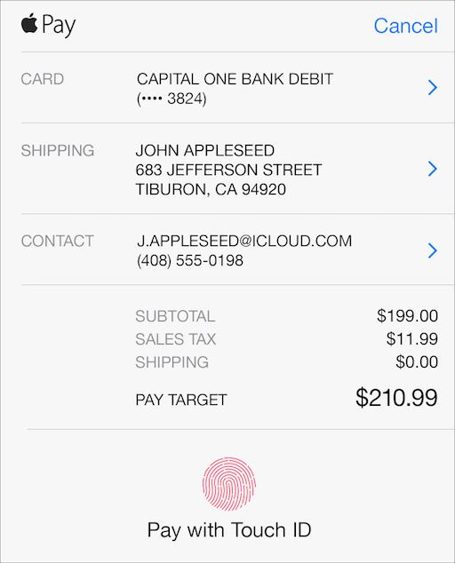

## 3.4 苹果的移动支付平台(Apple Pay)
Apple Pay 是苹果公司面向 iOS 移动设备推出的一种简单、安全、个人的移动支付方式。当用户在购买实体商品和服务时时，可以使用 Apple Pay 快速、安全地提供个人联系方式、收货地址以及付款信息。

通过用 Apple Pay 支付，用户无需每次购物都要创建账号或填一遍个人信息。Apple Pay 显著加快了支付流程，有助于消除前期的各种信息登记，进而为用户的“无障碍”选购过程提供更好的体验。欲了解更多信息，请参阅 [Apple Pay Programming Guide](https://developer.apple.com/library/ios/ApplePay_Guide/index.html#//apple_ref/doc/uid/TP40014764). Apple Pay 的用户界面非常清晰、简洁高效、低调。它包含三个界面元素，各出现在不同的上下文情境中。

按钮。Apple Pay 的按钮用来告诉用户，他们可以在当前的情境下(比如商品页面)完成购买。当用户点击了 Apple Pay 的按钮，立即显示支付上拉菜单(见下文) 开始帮助用户完成支付流程。用户通过“设置 Apple Pay”的选项 Apple Pay 的相关银行卡信息绑定操作。通过调用 PKPaymentButton API 口可以找到这两个按钮(想要了解更多信息，请查阅 [PKPaymentButton Class Reference](https://developer.apple.com/library/ios/documentation/PassKit/Reference/PKPaymentButton_Class/index.html#//apple_ref/doc/uid/TP40015149))。有关使用 Apple Pay 支付按钮的更多详情，请参阅 [Identity Guidelines](https://developer.apple.com/apple-pay/Apple-Pay-Identity-Guidelines.pdf).

**Apple Pay支付标识。**当用户需要在授权支付之前选择付款方式并敲定其他信息时，他们期望看到 Apple Pay 的支付标识。Apple Pay 的支付标识应该同其他付款方式以相同或类似的格式显示。

**支付上拉菜单。**在用户提交订单以及完成相关支付之前，Apple Pay 会显示一个包含了联系方式、收货地址以及与结账相关付款信息的支付上拉菜单。尽管用户依然可以在支付上拉菜单里做些微调，比如选择不同的送货方式，但他们不用做出重大改变或输入其他信息。当用户看到该支付上拉菜单，他们应该能够立即完成交易并授权付款。

**对于可以使用 Apple Pay 付费的用户，Apple Pay 的用户界面应当始终显示。**如果用户的移动设备支持 Apple Pay，并且他们已经激活了相关可用的银行卡因此可以通过将 Apple Pay 设为默认支付方式来满足用户的期望。

**如果用户无法使用 Apple Pay 服务，就不要显示任何 Apple Pay 的用户界面。**如果用户使用的设备不支持 Apple Pay，仍强行将其作为一个支付方式选项，可能会对用户造成混淆。但是，如果用户使用的设备是支持 Apple Pay，但没有绑定任何信用卡或借记卡，你可以在界面中显示“设置 Apple Pay”的按钮。

**当用户点击了 Apple Pay 的按钮，立即显示支付上拉菜单。**当用户决定使用 Apple Pay 来结账时，如果还要迫使用户经历额外步骤，会使支付流程显得复杂，增加不必要的矛盾，并可能会让用户感到沮丧受挫。当用户点击了 Apple Pay 按钮，不要显示其他警告或模态对话框视图。如果用户可以提供像打折或促销代码之类的信息，请在用户点击 Apple Pay 按钮之前找到一种方式来接收该信息。

**Apple Pay 按钮与其他可见的支付按钮应保持相同的尺寸大小或更大。**将 Apple Pay 按钮放置在醒目的位置，可以帮助用户轻松找到它。

**使用 Handoff 功能帮助用户完成在 Apple Watch 上发起的购买。** Apple Watch 佩戴者可以在商店完成支付，但他们无法完成由 Apple Watch 第三方应用程序调用的支付行为。当 Apple Watch 佩戴者发起了由第三方应用程序调用的支付行为，则显示一条消息告诉他们请在 iPhone 上完成支付。为了更好的用户体验，还可以使用 Handoff 功能深层链接到你的 iOS 应用程序上，并立即显示包含预设好的相应付款信息的支付上拉菜单。

有关使用 Apple Pay 支付按钮以及 Apple Pay 支付标识的更多信息指南，请参阅 [Apple Pay Identity Guidelines](https://developer.apple.com/apple-pay/Apple-Pay-Identity-Guidelines.pdf).

### 3.4.1 自定义支付上拉菜单 (Customizing the Payment Sheet)
根据完成交易付款所需要了解的信息，以及所要传达给用户关于本次购物的信息，来自定义 Apple Pay 支付上拉菜单所要显示的内容。

**支付上拉菜单仅显示对完成交易付款有必要的信息。**如果 Apple Pay 支付上拉菜单显示了些无关的信息，用户可能会感到困惑或焦虑。举个例子，如果商品是在线交付或通过电子方式完成，需要联系人的电子邮件地址是有意义的，而不是收货地址。在这种情况下，要求收货地址可能给用户产生会有什么东西将意外被派件到家中或公司的错觉，或许还可能导致他们对个人隐私被访问产生不必要的担忧。

**支付上拉菜单允许用户可以选择更换送件或取件方式。**用户可以从你在支付上拉菜单中设定的几种交付方式中随意选择一种。通过用文本标签控件、报价以及可选的第二行预计到达日期，来具体描述一种收货方式。另外，你还可以设定交付方式为“派件”或“取件”，让用户指定一个可接收快递送货上门或需要运输服务取件的位置。

**使用并排项来描述周期性付款和一些购买费用的小计。**并排项包含了一个标签文本和花费数值。并排项被用来：

- 表明用户授权一个定期付款项目，比如“每月订阅 $19.99”
- 告知用户关于额外费用，比如“礼品包装 $5.00”和“税费 $4.53”
- 显示优惠券或折扣信息带来的减价，比如“周五特价 -$2.00”
- 描述某个项目需要按实际计费，比如运输服务“时间&距离 …”
- 不要用并排项来显示所要购买的商品的构成清单。

**创建并排项标签时，尽可能显示在同一行。**并排项标签应该具体、容易理解。如果行条目标签字符数过长，那么很难让你的用户一看就懂。

**商户名称需要紧紧跟随在同一行的“Pay”字符后面作为一个整体。**确保所使用的商户名称以及相应的开销支出，必须与用户检查自己的信用卡或银行对账单时的数据保持一致。这一点很重要，因为它有助于用户确信他们的开销支出是无误的。如果你的应用程序只是作为中间媒介，而不是最终的商户支付，请明确向用户表明这个具体说明“付款给 最终的商户名称(通过 你的应用程序名称)。

**如果总价花费在支付授权时还不明确，请向用户传达有可能会有额外费用的信息。**举个例子，一次汽车旅程从支付授权时刻起到驶向最终目的地，它的开销报价可能会受行车距离或时间的影响变化。或者，一个客户可能想要给点小费在商品已派件之后。对于这样的情况，在支付上拉菜单中给予一个非常明确的解释说明是很有必要的。当你使用一个并排项来配置最终总价的更新信息时，总价金额会自动显示为“总价待定”。另外，如果你是预授权支付一个具体金额的订单，确保支付上拉菜单准确地反映了这一信息。

### 3.4.2 简化结账流程(Streamlining the Checkout Process)
Apple Pay 使得购物变得快速、简单，对此人们会欣然接受的。更少的步骤和更少的需要用户手动输入的信息，使得整个结账流程更好。

**始终使用 Apple Pay 的最新数据信息。**假设用户一直保持 Apple Pay 个人信息的完整性和时刻更新，那么不要依赖于任何先前收集的信息。即使你以前已收集过用户的联系方式、交付方式和支付信息，也要在结账时获取来自 Apple Pay 的最新信息。在结账环节，尽量避免用户输入本可以从 Apple Pay 获取的任何信息。

**使用 Apple Pay 加快购买。**对于单个商品项目的购买，让用户只需通过点击商品页面上的 Apple Pay 支付按钮，即可显示支付上拉菜单并进行即时结算。购买单个商品时，无需采取额外的步骤，也无需将商品添加到购物车，用户喜欢在应用程序中体验到这种便利性。对于多个商品被添加到购物车中会使用相同的交付方式被送到相同地址的情况，一旦用户有意向支付时，会通过显示支付上拉菜单的快速结账流程来支持。

**在显示支付上拉菜单前需提前收集好赎回代码或促销代码。**因为在 Apple Pay 支付上拉菜单中没有办法输入这些代码，请务必在显示支付上拉菜单之前收集好相关代码。

**如果人们可以将购买的商品派送到不同地方，或以不同的速度发货，请在显示支付上拉菜单之前提前收集好该信息。**对于这种极端情况，你需要在显示支付上拉菜单之前得到发货信息，因为在支付上拉菜单中没有办法来指定多种交付方式和地址。一般情况下，在支付上拉菜单中务必收集到交付方式和地址信息。

**显示订单确认页面或致谢页面。**在交易完成时，通过使用订单确认页，以这种直接的用户体验来显示关于商品能派送到的预计时间以及用户如何跟进订单状态的信息。

OK 如果合适的话，请在你的订单确认页上提到 Apple Pay。OK 尽管在你的确认页面上提到 Apple Pay 不是必要的，如果你愿意选，可以使用其中的一种格式：

“Visa ▪▪▪▪1234(Apple Pay)”
“用 Apple Pay 已完成付款”