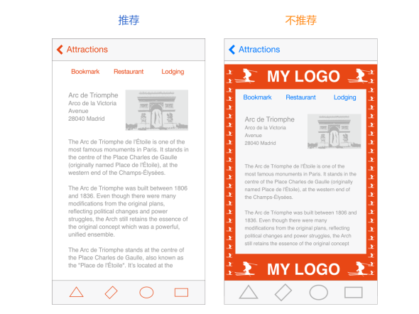

## 1.9 品牌推广(Branding)
成功的品牌推广不仅仅包括在应用中添加品牌元素。优秀的应用应该通过创建独特的外观和感觉来为用户提供愉悦、难忘的体验。

在 iOS 系统之下可以很容易地使用自定义的图标、颜色和字体来创建区别于其他应用的 UI。当你进行这些元素的设计时，牢记以下两点：

- 每个自定义的元素本身都需要具备良好的观感和功能性，但它也应该与应用中其他元素保持一致，无论应用中其他元素是自定义的还是标准的。
- 为了在 iOS 中感觉舒适，你的应用虽然不必看起来跟内置的一样，但是需要对它的遵从、清晰度和深度(如欲了解更多，参见1为 iOS 而设计(Design for iOS))进行整合。花些时间弄清楚在你的应用中遵从、清晰和深度所代表的意味，并把它们在你的自定义元素中表达出来。

当你需要让用户意识到你的品牌时，你应该遵循以下几点：

**以精致优雅不唐突的方式植入品牌元素。**用户使用你的应用来完成事务或者进行娱乐，他们不希望被强迫着去观看广告。为了获得最好的用户体验，你可以通过字体、颜色和图像的设计来潜移默化地地提醒用户你的品牌身份。

**避免远离用户关心的内容。**不要像上图中的反例那样将仅有品牌意义的内容放在屏幕顶部二级栏上持续展示，使正文内容空间被压缩，而是考虑以其他低侵入性的方法无处不在地展示品牌，如使用自定义颜色、字体，或巧妙地定制屏幕的背景。

**抵抗住诱惑，不要把你的 logo 贯穿整个应用。**移动设备的屏幕多数相当小，logo 的每一次出现都会占据空间，从而将用户与他们想看的内容隔离开。而且，在应用中显示 logo 并不能像在网页中显示 logo 那样达到相同的目的：对于用户来说通常会很容易在不知道网页所属的情况下访问一个网页，但却极少有用户会在完全不看一个 iOS 系统中的应用图标的情况下就打开它。