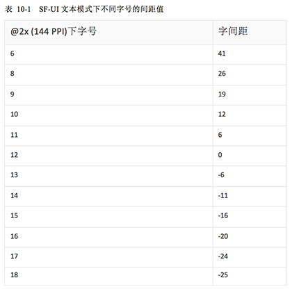
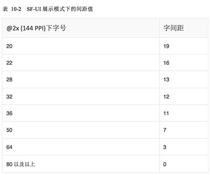
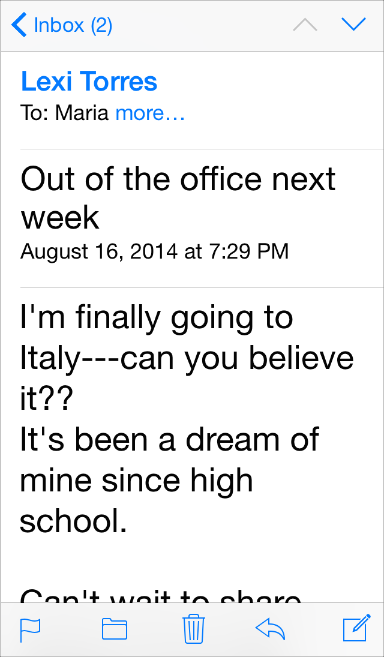
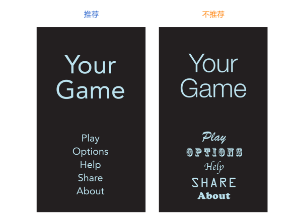

## 1.10 颜色与字体(Color and Typography)
### 1.10.1 色彩有助于增进沟通(Color Enhances Communication)
在 iOS 系统中，颜色会用于表明交互，传递活性以及提供视觉连续性。内置的应用程序选择使用那些看起来更具个性的、纯粹、干净的颜色，并辅以或亮或暗的背景组合。

**如果你要创建多样的自定义颜色，要确保它们能够和谐共存。**例如，如果你的应用的基本风格是柔和的色调，你就应该创建一个协调的柔和色调的色板用于整个应用。

**注意在不同情境下的颜色对比。**例如，如果在导航栏的背景与栏按钮标题之间没有足够的对比，按钮就会很难被用户看到。一个快速但不严谨的方法是通过将设备置于不同的光照环境之中(包括晴朗的室外)来测试设备上的颜色是否具有足够的对比度。

虽然在设备上查看你的应用能够在一定程度上帮助你找到需要调整的地方，但这仍代替不了能产生可靠结果的更科学客观的方法。这种方法涉及到判定前景色和背景色的亮度值是否符合一定的比率。这个比率值可以通过在线对比度计算器或者根据 WCAG2.0 标准中提供的公式自己计算获得。你应用中理想的颜色对比度应该是4.5:1或更高。

**当你使用自定义的栏颜色时，着重考虑半透明的栏和应用内容。**当你需要创建能匹配特别颜色的栏颜色时(比如一个已有品牌中的颜色)，可能在你获得你想要的结果之前，你需要用各种颜色进行实验。栏的显示将会同时受到 iOS 系统所提供的半透明栏与藏在栏后面的应用内容的呈现所影响。

API 注：使用浅色(tintColor)的属性值给予栏按钮颜色，使用栏浅色(barTintColor)的属性值为栏本身赋色。欲了解更多关于栏属性的内容，可参见 UINavigationBar Class Reference,，UITabBar Class Reference，UIToolbar Class Reference和 UISearchBar Class Reference.

**注意颜色的盲区。**多数色盲的人很难区分红色与绿色。需要对你的应用进行测试以确保在其中你没有将红色与绿色作为区分两个不同状态或值的唯一方式，一些图像编辑软件或工具能够有效的帮你验证颜色的盲区。通常意义来说，使用多种方式来表征原色的交互性是非常好的(需要了解更多关于在 iOS 系统中表征交互性的信息，请参阅 [Interactive Elements Invite Touch)](https://developer.apple.com/library/ios/documentation/UserExperience/Conceptual/MobileHIG/InteractivityInput.html#//apple_ref/doc/uid/TP40006556-CH55-SW4)。

**考虑选择一种基准色颜色来表征交互性与状态。**内置的应用里的基准色包括比如备忘录中的黄色，和日历中的红色等等。如果你定义一种用于表征交互和状态的基准色，要确保你的应用中的其他颜色不会与它发生冲突。

**避免给可交互和不可交互的元素使用相同的颜色。**色彩是表明 UI 元素交互属性的方式之一。如果可交互和不可交互的元素使用相同的颜色，用户将会难以判断哪些区域是可点的。

**色彩可以向用户传达信息，但不一定会以你希望的方式。**每个人眼中的色彩是不一样的，不同的文化为色彩赋予的意义也是不相同的。花时间来研究如何使用色彩才可能会被其他国家或者文化接受。你要尽可能确定应用中运用的色彩向用户传达了恰当的信息。

**大多数情况下，不能让颜色喧宾夺主，让用户分心。**除非色彩是应用的目的和本质所在，通常情况下色彩应该用来从细微细节之处提升用户体验。

### 1.10.2 优秀的排版提供清晰的传达(Great Typography Enables Clear Communication)
Apple 为全平台设计了 San Francisco 字体以提供一种优雅的、一致的排版方式和阅读体验。在 iOS 9及未来的版本中，San Francisco 是系统字体。

San Francisco 搭配 Dynamic Type，可以为您提供：

- 一系列的字号大小，在任何用户设置，包括可访问性设置下，可获得优质的清晰度和极佳的阅读体验。
- 自动调整文字的粗细，字母间距以及行高的能力。
- 为语义上有区别的文本模块指定不同的文本样式，比如正文、脚注或者标题。
- 文本可以根据用户在字号设置和可访问性设置中指定字体大小的变化作出适当的响应的能力
下载 San Francisco 可访问 https://developer.apple.com/fonts/.(注意：iOS9中的 San Francisco 字体取名为 SF-UI)。当你在你的 app 中采用 San Francisco 时，你可以调整模拟器>设置中的值来测试在不同尺寸下你的 app 的文本。

注：如果你是用自定义字体，你仍然可以采用 Dynamic Type 或根据系统的字号设置来规划字体范围。当用户改变设置时，你的应用也必须响应式的配合。如需了解如何使用文字样式并确保当用户改变文字型号设置时你的应用能够获取通知，可以参考 Text Styles.

San Francisco 有两类尺寸: 文本模式(Text)和 展示模式(Display)。 文本模式适用于小于20点(points)的尺寸，展示模式适用于大于20点(points)的尺寸。当你在你的 app 中使用 San Francisco 时，iOS 会自动在适当的时机在文本模式和展示模式中切换。

注：如果你使用应用程序如 Sketch 或 Photoshop 来生成你的设计，那么当你设置的字体不小于20点的时候，你需要切换到展示模式。iOS 会根据字体大小为 San Francisco 自动调整字间距。(字间距是以用作于修改文字间距)。表格10-1 和 10-2分别是文本模式(Text)和展示模式(Display) 在不同字号下的间距值。

为了突出某些文字或者为了在内容块之间建立视觉关联，你可以依赖由 Dynamic Type 支持的语义化样式，如标题、正文，你也可以指定字体权重，如细体或者半粗。使用 Dynamic Type 样式使得你的内容能更好地表达含义，但如果你想要对你的设计有更好的把控能力，你可以对特定的文字设置特定的权重。(想要了解更多关于调整字体权重， 可以参阅 [UIFont Class Reference](https://developer.apple.com/library/ios/documentation/UIKit/Reference/UIFont_Class/index.html#//apple_ref/doc/uid/TP40006891).)

例如，你可能想要增加某些文字的权重，来帮助用户可视化你的内容的层次结构，或者把用户的注意力吸引到特定的词或短语。另外，你可以通过增加较小文字的权重和减小较大文字的权重，在多个不同字号的、相邻的标签中建立视觉凝聚。字体权重在内容的整体风格和表达中有重要影响，因此你可以选择特定的权重来达到设计目的。

**文本尺寸的响应式变化需要优先考虑内容。**并不是所有的内容对于用户都是同等重要的。当用户选择更大的文本尺寸时，他们是想要使他们关注的内容更容易阅读；他们并不总是想要屏幕上的每个单词都更大。

例如，当用户选择具备更大易用性的文本尺寸时，邮件将会以更大的尺寸显示邮件的主题和内容，而对于那些没那么重要的信息——如时间和收件人——则采用较小的尺寸。

**确保一个自定义字体在不同尺寸下的所有类型都具备可读性。**实现这一效果的方法之一是效仿在不同的文本尺寸下 iOS 系统呈现字体样式的一些方法。例如：

- 文本永远都不应该小于11点(points)，即使是用户选择极小的文本尺寸。相较而言，内容样式使用17点的字号作为大尺寸，这也是默认的文本字号。
- 通常来说，字号与行距值在每一档的文本尺寸设置中差别为1点。唯一例外的是两种标题的样式，它们在极小、小和中尺寸的设置中均使用相同的字号、行距和字距。
- 在最小的三种文本尺寸中，字间距相对较大；而在最大的三中文本尺寸中，字间距相对紧凑。
- 标题和内容的样式使用相同的字体尺寸，同时，为了区分标题与内容样式，标题样式使用更重的值。
- 导航控制栏的文本使用相同的字号，而内容文本的样式则使用大尺寸的设置(值为17点)。
- 文本总是使用常规或者中重，一般不适用轻或者加粗。
**通常情况下，应用中整体应该使用单一字体。**多种字体的混杂会使你的应用看上去支离破碎和草率。相反，使用一种字体和少数样式。根据语义用途，使用 [UIFont](https://developer.apple.com/library/prerelease/ios/documentation/UIKit/Reference/UIFont_Class/Reference/Reference.html#//apple_ref/occ/cl/UIFont) 类的 API 来定义不同文本区域的样式，比如正文或者标题。

