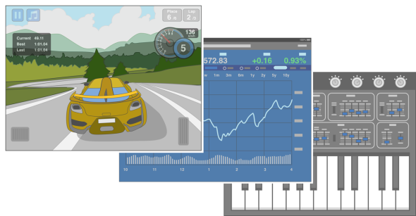
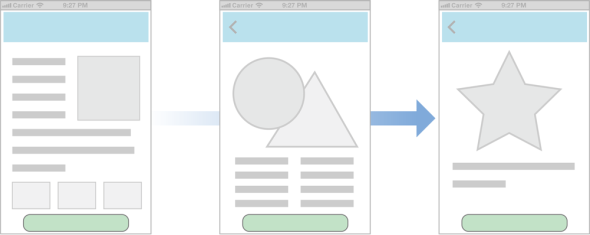
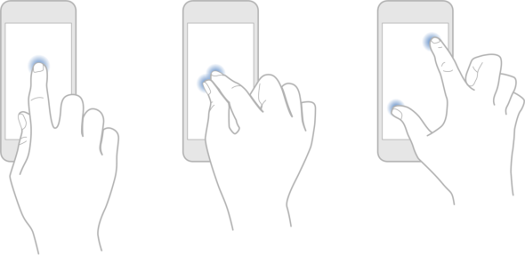
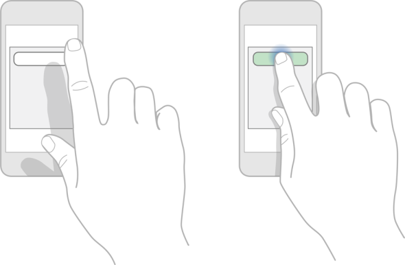

## 2.1 设计原则(Design Principles)
### 2.1.1 美学完整性(Aesthetic Integrity)
美学完整性不评判应用的视觉设计，也不是用来描述应用的风格特征。美学完整性是指在一款应用的视觉表现和交互行为与功能结合后所传达出的整体一致性。

人们关心应用是否提供了应有的功能，但是也会潜移默化甚至是很直接地被应用的视觉表现和交互行为所影响。举个例子，一款协助用户完成任务的应用，可以通过使用精美而又无干扰的装饰性元素、标准的控件和可预期的交互行为很好地帮助用户聚焦在任务本身上。这样，应用就能传达出清晰而一致的信息，使得人们信任它。但是，如果应用使用干扰的、琐碎的或随意的 UI 来呈现任务，那么人们可能会对其可靠性和可信赖度产生怀疑。

另一方面，在沉浸式应用中—例如游戏—用户期待惊艳的视觉表现，为用户带来乐趣和刺激，并鼓励用户进行探索。用户不是要在游戏中完成严肃的或程序式的任务，他们更期待游戏的视觉表现和交互行为与当前的目的进行整合。

### 2.1.2 一致性(Consistency)
一致性可以让人们在一款应用中的不同部分甚至不同应用间复用使用同样的认知和技能。一款具备一致性的应用不应盲从地复制其他应用，也不应在风格上一成不变。相反，它们专注于让人们觉得舒适的标准和范例，并提供应用内部统一的体验。

在判断一款 iOS 应用是否要遵守一致性原则时，请思考如下问题：

- 应用是否和 iOS 标准一致？是否正确地使用了系统提供的控件、视图和图标？是否按照用户所预期的方式整合了设备的特性？
- 应用是否内部统一？文案是否使用了一致的措辞和风格？同样的图标是否表意相同？在不同的位置执行同样的操作时，人们是否能能预期会发生什么？应用中自定义的 UI 元素是否在外观和行为上保持一致？
- 应用是否和先前的版本保持一致？条款和意义是否保持不变？基本概念和主要功能是否发生了变化？
### 2.1.3 直接操作(Direct Manipulation)
当人们不再使用一堆控件进行操作，而是直接在屏幕上操作对象时，他们能更集中精力完成任务，也更容易理解这些行为所产生的结果。

使用多点触摸界面，人们可以通过捏合操作来直接放大和缩小图片或文本内容。在游戏中，玩家可以直接与屏幕上的对象进行交互。例如，游戏中可能会显示密码锁，用户可以通过转动它来打开。

在一款 iOS 应用中，如下情况中人们应该能够进行直接操作：

- 旋转或者移动设备来影响屏幕上的对象
- 使用手势来操作屏幕上的对象
- 显示即时可视的操作反馈
### 2.1.4 反馈(Feedback)
反馈可以明示人们的行为，呈现操作结果，并更新于任务进程之中。

iOS 内置的应用对用户的每个行为都提供了可感知的反馈。当人们点击列表项和控件时，它们会被临时高亮，并会在操作过程中持续一段时间，以此展示控件被执行的过程。

精细的动画会给人们带来有意义的反馈，帮助阐明行为的结果。例如，列表中新增一项时的动画可以从视觉上帮助人们发现列表的变化。

音效同样可以为人们提供有效的反馈，但不应成为唯一的反馈方式，因为人们不一定能听到。

### 2.1.5 隐喻(Metaphors)
当应用中的虚拟对象和交互行为与用户已经熟悉的体验相似时—无论这些体验是来源于真实或数字生活—用户就可以快速地掌握如何来使用这个应用。

当应用使用隐喻来传达某种用法或体验时，最好不要让隐喻突破所依赖的对象或交互行为本身的限制。(译者注：此处可理解为对于隐喻的使用应量力而为，不要过于牵强。)

由于人们实际上是和屏幕进行物理上的交互，所以iOS应用有很大的余地来使用隐喻。iOS 中的隐喻包括：

- 移动分层视图来显示被遮挡的内容
- 拖曳、轻扫和滑动游戏中的对象
- 点击开关，滑动滑块，转动选择器
- 轻扫来翻阅书本或杂志
### 2.1.6 用户控制(User Control)
是人—而不是应用—发起和控制行为。应用可以对用户进行操作建议，对有危害的后果予以警示，但是不应替用户来做决策。好的应用会在用户需要时给予帮助和避免不必要的结果之间作出平衡。

当对应用的交互行为和控件都较为熟悉和可预期时，用户会觉得应用更易上手。那些简单直白的交互行为更容易被用户所理解和记住。

人们会希望在一个操作被执行之前有足够的机会来取消，也希望在执行一个不可逆的操作之前可以有机会来进行确认。最后，人们还会希望能够停止正在执行中的操作。