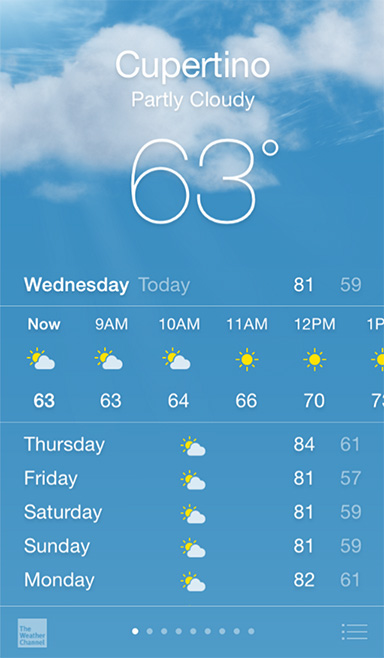
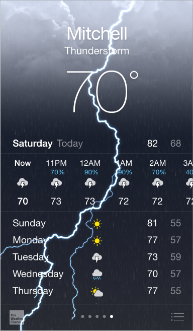
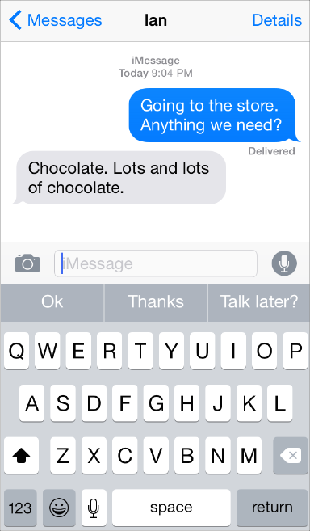
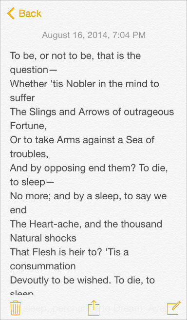
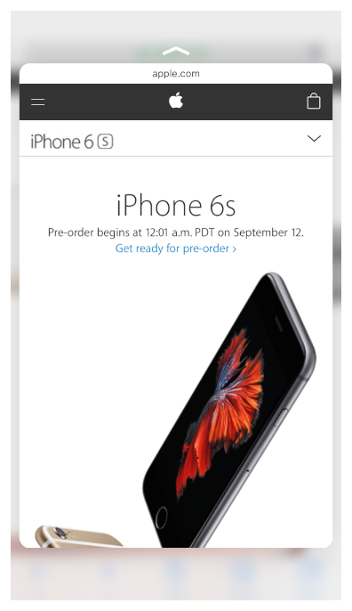
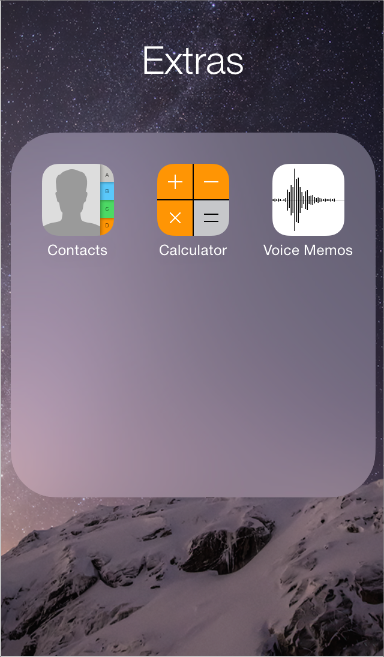
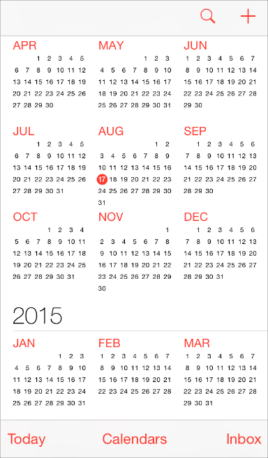
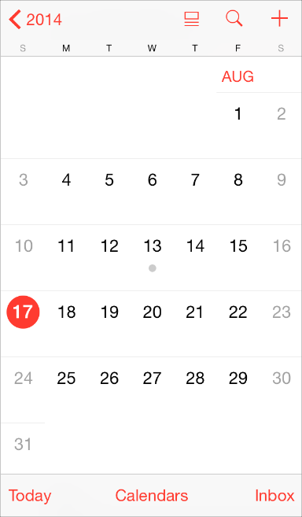
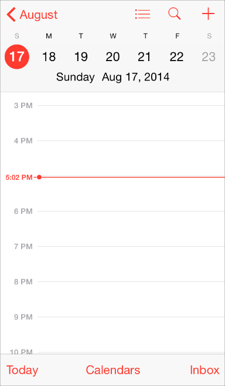

## 1.1 为 iOS 而设计(Designing for iOS)
iOS 表现了以下三大设计原则：

- **遵从(Deference)**：UI 应该有助于用户更好地理解内容并与之交互，并且不会分散用户对内容本身的注意力。
- **清晰(Clarity)**：各种尺寸的文字清晰易读；图标应该精确醒目，去除多余的修饰，突出重点，以功能驱动设计。
- **深度(Depth)**：视觉的层次感和生动的交互动画会赋予 UI 新的活力，有助于用户更好地理解并让用户在使用过程中感到愉悦。

无论你是重新设计现有的应用，还是重新开发一个新应用，请基于下列方法进行设计考虑：

- 首先，去除掉 UI 元素让应用的核心功能突显出来，并明确之间的相关性。
- 然后，使用 iOS 的主题来定义 UI 并进行用户体验设计。完善细节设计，以及适当合理的修饰。
- 最后，保证你设计的 UI 可以适配各种设备和各种操作模式，使得用户在不同场景下都可以享受你的应用。
在整个设计过程中，时刻准备着推翻先例，质疑各种假设，并以内容和功能视为重点来驱动每个细节的设计。

### 1.1.1 设计跟随内容 (Defer to Content)
尽管清新美观的 UI 和流畅的动态效果都是 iOS 体验的亮点，但内容始终是 iOS 的核心。

这里有一些方法可以确保你的设计既可以提升功能体验，又可以关注内容本身。

**充分利用整个屏幕。**系统天气应用是这个方法的绝佳范例：用漂亮的全屏天气图片呈现现在的天气，直观地向用户传递了最重要的信息，同时也留出空间呈现了每个时段的天气数据。

**重新考虑(尽量减少)拟物化设计的使用。**遮罩、渐变和阴影有时会让 UI 元素显得很厚重，导致影响到了对内容的关注。相反，应该以内容为核心，让用户界面成为内容的支撑。

**用半透明 UI 元素样式来暗示背后的内容。**半透明的控件元素(比如控制中心)可以提供了上下文的使用场景，帮助用户看到更多可用的内容，并可以起到短暂的提示作用。在 iOS 中，半透明的控件元素只让它遮挡住的地方变得模糊——看上去像蒙着一层米纸——它并没有遮挡屏幕剩余的部分。

### 1.1.2 保证清晰(Provide Clarity)
确保你的应用始终是以内容为核心的另一个方法是保证清晰度。这里有几种方法可以让最重要的内容和功能清晰可见，且易于交互。

**使用大量留白。**留白可以使重要的内容和功能更加醒目、更易理解。留白还可以传达一种平静和安宁的心理感受，它可以使一个应用看起来更加聚焦和高效。

**让颜色简化 UI。**使用一个主题色——比如 Notes 中用了黄色——高亮了重要区块的信息并巧妙地用样式暗示可交互性。同时，也让应用有了一致的视觉主题。内置的应用使用了同系列的系统颜色，这样一来，无论在深色或浅色背景上看起来都很干净，纯粹。

**通过使用系统字体确保易读性。**iOS 的系统字体(San Francisco)使用动态类型(Dynamic Type)来自动调整字间距和行间距，使文本在任何尺寸大小下都清晰易读。无论你是使用系统字体还是自定义字体，一定要采用动态类型，这样一来当用户选择不同字体尺寸时，你的应用才可以及时做出响应。

**使用无边框的按钮。**默认情况下，所有的栏(bar)上的按钮都是无边框的。在内容区域，通过文案、颜色以及操作指引标题来表明该无边框按钮的可交互性。当它被激活时，按钮可以显示较窄的边框或浅色背景作为操作响应。

### 1.1.3 用深度层次来进行交流(Use Depth to Communicate)
iOS 经常在不同的视图层级上展现内容，用以表达层次结构和位置，这样可以帮助用户了解屏幕上对象之间的关系。

对于支持 3D 触控的设备，轻压(Peek)、重压(Pop)，以及快捷操作(Quick Actions)能让用户在不离开当前界面的情景下预览其他重要内容。

通过使用一个在主屏幕上方的半透明背景浮层，这样文件夹就能清楚地把内容和屏幕上其他内容区分开来。

如图所示，备忘录(Reminders)以不同的层级展示内容条目。用户在使用备忘录里的某个条目时，其他条目会被集中收起在屏幕下方。

日历具有较深的层级，当用户在翻阅年、月、日时，增强的转场动画效果给用户一种层级纵深感。在滚动年份视图时，用户可以即时看到今天的日期以及其他日历任务。

当用户选择了某个月份，年份视图会局部放大该月份，过渡到月份视图。今天的日期依然处于高亮状态，年份会显示在返回按钮处，这样用户可以清楚地知道他们在哪儿，他们从哪里进来以及如何返回。

类似的过渡动画也出现在用户选择某个日期时：月份视图从所选位置分开，将所在的周日期推向内容区顶端并显示以小时为单位的当天时间轴视图。这些交互动画增强了年、月、日之间的层级关系以及用户的感知。

