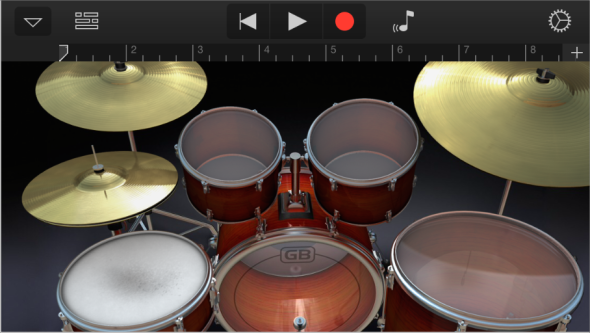

## 2.2 从概念到产品(From Concept to Product)
### 2.2.1 定义应用(Define Your App)
应用的定义是对应用主要功能和目标用户的简明具体的描述。

尽可能早的创建应用的定义可以帮助你将一个想法和功能清单转换为用户想要的条理清晰的产品。在开发过程中，可以使用定义来决定某些功能和行为是否合理。使用以下几个步骤来创建一个可靠的应用定义。

**1.列出所有你认为用户可能喜欢的功能**

可以直接进行头脑风暴。此时，你需要列出所有与产品核心想法有关的任务。不用担心清单太长，因为接下来会进行删减。

假设你一开始的想法是开发一个帮助人们购买食品杂货的应用。你可以思考在进行这项活动时，会涉及到那些相关的任务，这些就是用户可能感兴趣的潜在功能。例如：

- 创建清单
- 查找食谱
- 比较价格
- 定位商店
- 给食谱做注释
- 查找并使用的优惠劵
- 查看烹饪演示
- 探索不同的烹调方法
- 寻找某些食材的替代物
**2.确定目标用户**

现在你需要清楚的将你的应用用户与其他 iOS 用户区分开来。确定在此情此景下，什么是对你的用户最重要的。在食品杂货例子中，你可能需要问问你的用户：

- 通常是在家里做饭还是更喜欢现成的食物
- 是忠实的优惠券用户还是认为优惠券没多大价值
- 喜欢寻找特别的食材还是喜欢基本食材
- 严格的按照食谱做菜还是只把食谱当做灵感来源
- 喜欢少量多次购买还是一次性购买大量食物
- 希望能保留多个不同目的的购物清单还是只希望记录回家路上需要购买的几个东西
- 坚持使用固定的品牌还是会使用方便的替代品
- 习惯于购买固定的一些物品还是会按照食谱来购买
思考过这些问题之后，假设你可以提取出目标用户的三个特征：喜欢按照食谱进行尝试，时常很匆忙，通常情况下比较节俭。

**3.根据目标用户过滤功能清单**

如果在确定了一些用户特征后，你最终得到几个主要功能，恭喜你在做正确的事情：好的 iOS 应用应该是高度聚焦在能帮用户完成的任务上的。

例如，即使第一步想出的那些可能需要的功能都是有用的，也不一定是第二步定义的目标用户需要的。

当你在目标用户的使用情境下检查功能清单时，就可以判断你的应用应该聚焦在三个主要功能上：创建清单，获得并使用优惠劵，获得食谱。

此时你就可以给出应用定义了，总结该应用为谁做和做什么。食品杂货购买应用的定义可能如下：

“为热爱烹饪且节俭的用户订制的创建购物清单工具。”

**4.不止于此**

应用定义应该贯穿于整个开发过程，使用应用定义确定功能，控件，措辞的合理性。例如：

**当你想要新增一个功能时，**问问自己这对应用的主要目的和目标用户是否非常重要。如果不是，可以置之不理。例如，你已经确定了你的用户对大胆新颖的烹饪方法感兴趣，那么着重展示盒装蛋糕和现成的食物就不太合适。

**当你考虑用户界面的外观和操作时，**问问你自己你的用户更喜欢简单的、流线型的风格，还是有明显主题的风格。以用户目标为指导，理解用户期望通过你的应用完成什么，例如快速找到答案，找到深入而全面的内容或者娱乐。例如，尽管你的食品杂货清单应用需要易于理解和快速上手，但你的用户还是可能倾向于一个有关食物的主题界面。

**当你考虑应该使用怎样的措辞时，**考虑用户在这个领域的专业程度。例如，尽管你的用户可能不是由专业的大厨组成，但你也可以肯定他们希望看到有关食材和技术专用的措辞。

### 2.2.2 为任务量身订制界面(Tailor Customization to the Task)
最好的 iOS 应用根据清晰的目标和易用性来平衡用户界面的设计。为了达到这种平衡，要确保在设计阶段前期就考虑定制化。因为考虑品牌性，原创性和适销性通常会影响定制化的决策，所以专注于定制化怎样影响用户体验是难的。

开始考虑应用中的任务：用户执行这些任务的频率如何，在什么样的环境下进行？

举个例子，想象一个计算器应用使用的是精心设计的，充满艺术感的风格，并且使用了创新的层级去显示大家熟悉的计算元素。这像艺术品一样的细节渲染和创新层级并不会影响用户去理解怎样点击按钮和查看计算结果。但是对于只是简单的需要完成工作的用户，这种新奇的体验和美丽的界面很快就会失去效用，并且可能成为一种妨碍。

相反，随身录音室应用(GarageBand)可以不展示好看的、逼真的乐器来帮助用户制作音乐，但这样会使应用缺少身临其境的愉悦感。在随身录音室里，界面不只是向用户展示了如何使用，同样使得制作音乐的主任务更容易完成。

当你思考定制化如何增强或减弱用户完成任务的注意力时，记住以下几点：

**定制总要有缘由。**理想情况下，定制化的用户界面能促进用户完成任务并增强他们的体验。你最好尽可能的用任务驱动定制化决策。

**尽量避免增加用户的认知负担。**用户对标准界面元素的外观和行为都已经很熟悉了，所以他们不用停下来思考如何使用它们。当用户面对外观和行为与标准不同的元素时，他们就失去了经验的优势。除非你的独一无二的元素能够使任务更容易完成，否则用户很可能不喜欢被强制学习一些在其他应用都不通用的步骤。

**保持内部的一致性。**你的应用中自定义元素越多，保持这些元素外观和行为的一致性就越重要。如果用户花费时间去学习了你创建的那些不熟悉的控件，那么他们会希望新学到的这些操作能够在整个应用中通用。

**总是以内容为重点。**因为标准元素很熟悉，所以它们不会分散用户在内容上的注意力。当你自定义用户界面时，注意确保界面元素不会抢走用户对内容的注意力。例如，如果你的应用允许用户观看视频，你可能选择设计一个自定义的重播控件。但是不管你用的是自定义还是标准的重播控件，都没有它是否在用户开始观看后隐藏点击屏幕后出现来的重要。

**在对标准控件进行重设计时再三思考。**如果你不只是想自定义标准控件，而是想重设计，确保你的重设计能提供尽可能多的信息。例如，你设计了一个开关控件，它没有可以指明相反状态存在的信息，那么用户很可能意识不到这是个有两个状态的控件。

**一定要彻底测试自定义的界面元素。**在测试过程中，近距离的观察用户是否能预测你的元素如何使用以及是否能容易的与它们交互。例如，如果你创建的控件的可点击区域小于44 x 44像素，用户点击时就会有困难。或者如果你创建了一个视图对点击和滑动的反馈不一样，确保这个视图提供的功能值得用户去额外关注交互的不同。

### 2.2.3 原型 & 迭代(Prototype & Iterate)
在你投入工程资源实现设计之前，最好先创建原型来进行用户测试。即使只有几个同事来帮你测试原型，你也会收获一些关于应用功能和用户体验的新鲜观点。

在设计的早期阶段，你可以使用纸质的原型或者线框图去呈现主要的视图和控件，并且标明每个页面之间的跳转关系。你可以从线框图测试中获得一些有用的反馈，但是线框图的稀疏性有可能会误导用户。因为用户很难想象当线框被实际内容填满时体验会有什么样的变化。

如果你有一个可以在设备上运行的原型，那你可以得到更多有用的反馈。当用户能在设备上与你的原型进行交互时，他们能更容易的发现应用中哪里功能不满足预期，哪里体验过于复杂。

创建可靠原型的最简单的方法是使用基于故事版的 Xcode 模板创建一个基础应用，然后使用一些类似于占位符的内容来进行填充。(故事版可以涵盖应用中的所有界面，并且包括界面之间的跳转关系。)接着，将这个原型导入到设备中，这样被测者就可以有一个尽可能真实的体验了。

你不需要在原型中提供大量的实际内容或者使每一个控件都可用，但是你确实需要营造足够的情境来保证真实的体验。并且需要在典型用户体验和非典型的边缘情况之间做好平衡。例如，如果你的应用需要处理很长的列表项，你的原型就不能只显示一两个条目。而且在用户测试交互中，只要被测者能够点击屏幕上的一个区域进入到下一个逻辑页面或者完成主任务，那他们就可能提供更有建设性的反馈。

当你使用 Xcode 应用模板来创建原型时，你可以免费使用很多功能，并且它可以相对容易的进行设计中的响应反馈调节。在你确定设计方案并投入资源进行实现之前，应该对原型进行多次迭代测试。想要开始学习 Xcode，请参考 [Xcode Overview](https://developer.apple.com/library/ios/documentation/ToolsLanguages/Conceptual/Xcode_Overview/chapters/about.html#//apple_ref/doc/uid/TP40010215).