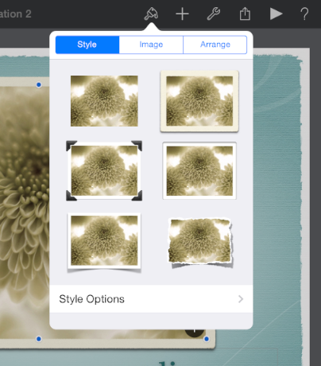

## 2.3 案例学习：从桌面到 iOS(Case Study: From Desktop to iOS)
### 2.3.1 iPad 版 Keynote 应用(Keynote on iPad)
桌面版的 Keynote 应用是一个十分强大而又灵活的应用，可以创建非常优秀的幻灯片。人们喜爱 Keynote 将简单易用与细粒度的操作结合进而控制无数精确细节的方式，如动画和文本属性等。

iPad 版的 Keynote 提取了桌面版 Keynote 的核心要素，并通过创造以下的用户体验使它在 iPad 上更舒适：

- 专注于用户输入的内容
- 通过削减功能降低系统的复杂度
- 提供有用而又令人愉悦的快捷操作
- 延续桌面版本的体验
- 利用动人的动画提供良好的反馈与交流
Keynote 用户能很快理解如何使用 iPad 版，是因为它使用了 iPad 原生的范例，符合了用户对功能上的预期。新用户可以用简单、自然的方式直接操控内容，所以可以很容易学会如何使用 iPad 版的 Keynote.

Keynote 从桌面版向 iPad 版的转变是基于从细节到整体的大量修改和重新设计的。以下是一些明显的修改：

**流线型的工具栏。**工具栏中只有少数的元素，但是它们是用户在创建内容时所需的所有功能和工具的统一入口。

**简化并优先响应用户焦点的检查器。**对于用户所选的需要修改的对象，iPad 版的 Keynote 能自动控制其工具和属性。(译者注：特别是根据当前的操作对象而有限选择某些工具。)通常，人们可以在第一检查器视图中完成他们需要的所有修改操作。如果他们需要修改那些不常用的属性，他们可以下拉另一个检查器视图来进行。

**丰富的预设样式集。**人们可以利用预设的样式很简单地改变对象(如表格或图表)的外观或者感觉。除了颜色之外，每个集中，例如表格的标题和轴区分标识等的预设属性都被设计得与整体的主题和谐一致。

**直接操作内容，丰富有意义的动画。**在 iPad 版的 Keynote 中，用户可以拖动滑块到一个新的位置，可以扭动旋转一个对象，也可以轻击图片来选中它。iPad 版 Keynote 的响应动画进一步加强了这种可直接操作的印象。例如，用户在移动某个滑块时它通常会暂停，而当它被放置在一个新的位置时，环绕在周围的滑块将会向外扩散给它留出空间。

### 2.3.2 iPhone 版邮件应用(Mail on iPhone)
邮件应用是 OS X 中一款好用而又广受好评的常见应用。它也是一个很强大的程序，可以允许用户撰写、接收、分类和存储邮件，追踪行动和事件，也可以编写备忘录和邀请等。桌面版的邮件应用通过一系列的窗口提供了这些强大的功能。

iPhone 版的邮件专注于桌面版邮件的核心功能，帮助人们接收、撰写、发送和组织他们的信息。为了塑造移动 iPhone 版的邮件应用，将这些功能浓缩在为其量身定制的界面之中，做了如下的工作：

- 将人们的内容前置和居中的合理化呈现
- 专为处理不同任务而设计的不同视图
- 易于浏览并符合认知的信息结构
- 适时提供强大的编辑和组织性工具
- 用微妙且动人的动画来传达动作和提供反馈
必须明白的是，相对于桌面版的邮件应用来说，iPhone 版的邮件应用不是(注：或者说并不需要是)一个更好的应用，而是为移动端用户重新设计的邮件应用。iPhone 版的邮件应用专注于桌面版的功能子集并将它们呈现在一个吸引人的精简界面之中，据此为移动端的用户提供了核心的邮件体验。

为了使邮件应用的体验能适应移动场景，iPhone 版的邮件应用在几个关键的方面革新了用户界面。

**直接、高度专注的页面。**每个页面显示了邮件应用体验的一个方面：账户列表、邮箱列表、消息列表、消息查看和编辑视图。用户可以在一个屏幕内滑动查看完整的内容。

**简单、可预期的导航。**通过每屏的一次点击，用户可以逐层展开综合内容(账户列表)进入具体页面(一封消息)。每个页面会显示一个标题用以指示用户所在的位置，以及一个返回按钮用以更容易地回溯到他们之前的步骤。

**需要时即可获取的、简单的点击性控件。**基本上在任何场景之下，编写邮件和查阅新邮件都是人们首要希望进行的操作，因此 iPhone 版的邮件应用保证了这两个功能在多个页面中都可以便利地进行。当用户查看一封消息时，就会显示诸如回复、移动和删除等对消息的操作。

**针对不同任务的不同类型的反馈。**当人们删除一封消息时，它会动态地进入垃圾桶图标中。当人们发送一封消息时，可以看到它的发送过程；而当发送结束时，人们可以听到一个特别的声音提示。通过消息列表页面工具栏的副标题，用户通过简单一瞥就可以查看邮箱上次更新的时间。

### 2.3.3 iOS 系统内的网页内容(Web Content in iOS)
iOS 版的 Safari 应用在 iOS 设备上提供了出众的移动网页浏览体验。人们喜欢阅读清晰的文字和图片，也希望能通过旋转设备或者捏合和点击屏幕来调整视图。

基于标准建立的网站可以在 iOS 设备上显示得很好。特别是那些能侦测设备并不需要插件的网站可以同时在 iPhone 和 iPad 上都表现得很好，两者之间不会需要太多的修改，即使有也很小。

除此之外，成功的网站应具备以下的特性：

- 如果页面宽度需要匹配设备宽度，可以设置合适的视窗(viewport)来适应设备
- 避免 CSS 中固定的定位，以便当用户缩放或拖动页面时内容无法被移出屏幕
- 拥有一套基于触控操作的用户界面，而不是依赖基于传统点击操作的交互
有时候，额外的一些修改可以(使页面)更合理。例如，在 iOS 系统中，很多网页应用会设置合适的视窗(viewport)宽度并通常隐藏 Safari 的 UI。如欲了解如何进行这些修改，参见 [Safari Web Content Guide](https://developer.apple.com/library/ios/documentation/AppleApplications/Reference/SafariWebContent/UsingtheViewport/UsingtheViewport.html#//apple_ref/doc/uid/TP40006509) 章节中的 [Configuring the Viewport](https://developer.apple.com/library/ios/documentation/AppleApplications/Reference/SafariWebContent/ConfiguringWebApplications/ConfiguringWebApplications.html#//apple_ref/doc/uid/TP40002051-CH3) 和 [Configuring Web Applications](https://developer.apple.com/library/ios/documentation/AppleApplications/Reference/SafariWebContent/ConfiguringWebApplications/ConfiguringWebApplications.html#//apple_ref/doc/uid/TP40002051-CH3).

网站也可以通过其他的方法适配桌面网页到 iOS 端的 Safari 浏览器中：

**使键盘适应 iOS 端的 Safari.** 当键盘和格式辅助信息出现时，iPhone 上的 Safari 应用会将你的网页显示在 URL 地址下方和键盘与格式辅助信息上方。

**使弹出式菜单适应iOS端的Safari.**在桌面版的 Safari 应用中，弹出式菜单会包含很多选项，就如在其他 OS X 应用中一样。在必要的情况下，菜单展开后可以超出应用窗口的边界以显示其中的所有选项。在 iOS 版的 Safari 应用中，弹出式菜单由原生的元素所呈现，这样能提供更好的用户体验。例如，在 iPhone 上，弹出式菜单会出现在选择器(picker)当中，选择器里会一个用户可选择的选项列表。(欲了解更多选择器控件的内容，可以参见[Picker](https://developer.apple.com/library/ios/documentation/UserExperience/Conceptual/MobileHIG/Controls.html#//apple_ref/doc/uid/TP40006556-CH15-SW23).)