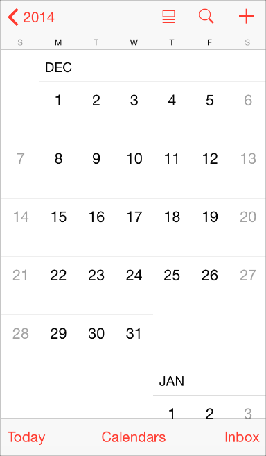

## 1.11 图标和图形(Icons and Graphics)
### 1.11.1 应用图标(The App Icon)
每个应用都需要一个漂亮的图标。用户常常会在看到应用图标的时候便建立起对应用的第一印象，并以此评判应用的品质、作用以及可靠性。

以下几点是你在设计应用图标时应当记住的。当你确定要开始设计时，请参考  [App Icon](https://developer.apple.com/library/ios/documentation/userexperience/conceptual/mobilehig/AppIcons.html#//apple_ref/doc/uid/TP40006556-CH19-SW1)来获取更详细的设计规格与指导。(译者注：App Icon 处在 iOS Human Interface Guidelines 的 Icon and Image Design 部分，翻译将在后续更新中放出，烦请各位耐心等候。)

- 应用图标是整个应用品牌的重要组成部分。将图标设计当成一个讲述应用背后的故事，以及与用户建立情感连接的机会。
- 最好的应用图标是独特的，整洁的，打动人心的，让人印象深刻的。
- 一个好的应用图标应该在不同的背景以及不同的规格下都同样美观。为了丰富大尺寸图标的质感而添加的细节有可能让图标在小尺寸时变得不清晰。
### 1.11.2 小图标(Small Icons)
iOS 提供了一系列小的 icon，用以代表各种常见任务与操作，它们常用在标签栏(Tab Bar)、工具栏(Toolbars)与导航栏(Navigation Bar)中。用户通常都已经了解这些内置图标的含义了，因此可以尽可能的多使用它们。

如果需要自定义动作或者内容，你也可以设计自定义图标。设计这些小的线性图标与设计应用图标有很大的区别，请参考 [Bar Button Icons](https://developer.apple.com/library/ios/documentation/userexperience/conceptual/mobilehig/BarIcons.html#//apple_ref/doc/uid/TP40006556-CH21-SW1)来了解更多内容。(译者注：Bar Button Icons 章节处在 iOS Human Interface Guidelines 的 Icon and Image Design 部分，翻译将在后续更新中放出，烦请各位耐心等候。)

请注意，你有时候也可以用文字来代替工具栏和导航栏的图标。 就像 iOS 的日历里面，工具栏上便是使用”今天”,”日历”和”收件箱”来代替图标进行表意的。

想要决定在工具栏和导航栏中到底是用图标还是文字，可以优先考虑一屏中最多会同时出现多少个图标。同一屏幕中图标的数量过多可能会让整个应用看起来难以理解。使用图标还是文字还取决于屏幕方向是横向还是纵向，因为水平视图下通常会拥有更多的空间，可以承载更多的文字。

### 1.11.3 图形(Graphics)
iOS 应用大多数图形丰富。无论是你需要展示用户的照片，还是需要创建自定义图片，以下这些需求都应该遵守：

- **支持 Retina 显示屏。**确保你应用中的所有图片资源都提供了高分辨率规格。尤其需要注意的是，iPhone 6 Plus 需要提供@3x规格的图片，而所有其他的高分辨率 iOS 设备都需要提供@2x规格的图片。
- **显示照片或图片时请使用原始尺寸，并不要将它拉伸到大于100%。**你不会希望在你的应用中看到拉伸和变形的图片。可以让用户自己来选择他们是否想要缩放图片。
**不要使用从苹果系列产品中复制的图形。**这些图形均受版权保护，而且产品的设计可能会频繁改变。

**不要将苹果的应用图标，图像或者截图用于你的设计中。**所有苹果的设计均受版权保护并且不允许出现在你的 UI 中，除非它们是由系统直接提供的。