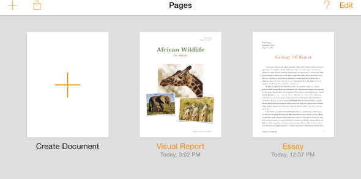

## 1.13 与 iOS 的整合(Integrating with iOS)
与 iOS 整合，指的是在当前平台上给用户提供一种舒适的、宾至如归般的体验，当然这并不意味着我们要把每一个应用做的和内置应用一模一样。

最好的与 iOS 整合的方式便是深刻地了解 iOS 的主题与核心——这一部分在上文为 iOS 而设计(Designing for iOS)部分中已有详细描述，并寻求出如何在你的应用中融合与表达这种主题。当你这么做的时候，遵循本章中的指引可以帮助你为你的用户提供他们想要的体验。

### 1.13.1 正确使用标准UI元素(Use Standard UI Elements Correctly)
尽可能使用 UIkit 提供的标准 UI 元素是一个好主意。多使用标准元素而非自定义元素，你与你的用户都将受益：

- 标准 UI 元素会根据 iOS 官方的更新而自动更新——而自定义元素不会。
- 标准 UI 元素对于你自定义外观和行为来说拥有优秀的扩展性。举个例子，iOS 中所有的视图(Views，从 UIView 中继承的对象)都是可以使用 TintColor 属性来定义颜色的，它让应用配色变得很简单。
- 用户更熟悉和习惯标准的元素，因为他们可以立刻明白你的应用中这些元素的用途。
想要充分地利用标准 UI 元素的优点，有一些关键点需要特别注意：

**严格遵循每个 UI 元素的设计规范。**当你应用中的 UI 元素的外观与功能都是用户所熟悉的，他们可以很容易地根据先前的经验来使用他们，进而更好地使用你的应用。你可以从这些章节中找到各种 UI 元素的设计规范：[Bars](https://developer.apple.com/library/ios/documentation/userexperience/conceptual/mobilehig/Bars.html#//apple_ref/doc/uid/TP40006556-CH12-SW1), [Content Views](https://developer.apple.com/library/ios/documentation/userexperience/conceptual/mobilehig/ContentViews.html#//apple_ref/doc/uid/TP40006556-CH13-SW1), [Controls](https://developer.apple.com/library/ios/documentation/userexperience/conceptual/mobilehig/Controls.html#//apple_ref/doc/uid/TP40006556-CH15-SW1), [Temporary Views](https://developer.apple.com/library/ios/documentation/userexperience/conceptual/mobilehig/Alerts.html#//apple_ref/doc/uid/TP40006556-CH14-SW1).

(译者注：上文提到的章节均处在 iOS Human Interface Guidelines 的第4章，翻译将在后续更新中放出，烦请各位耐心等候。若有需要，亦可先参考先前已翻译的 iOS7 UI Elements 章节：上，下。)

**不要混用不同版本的 iOS 里的 UI 元素。**你一定不希望让用户觉得你的 UI 元素来自于与当前用户的设备版本不同的 iOS 系统。

**大体来说，请避免创造自定义 UI 元素来表现标准交互行为。**先问问你自己为什么一定要创建一个与标准 UI 元素行为完全相同的自定义元素。如果你只是想改变标准 UI 元素的外观，可以考虑使用 UIKit 外观定制 API(UIKit appearance customization APIs)，或者给元素填充别的颜色。如果你需要定义一个与标准控件稍有不同的行为，请确保你在改变了这个 UI 元素的属性和行为之后，这个元素仍然能完成你所希望的操作。如果你需要完全自定义一个行为，最好是设计一个与标准元素完全不相像的自定义元素。

提示：Interface Builder 让获取标准 UI 元素，使用外观定制 API(the appearance customization APIs)，获取属性，以及在你的应用里使用自定义和系统自带图标变得很简单。想要了解更多 Interface Builder 的内容，请参阅 Xcode Overview.

**不要用系统自带的按钮和图标表达其他含义。**iOS 提供了多种可用的按钮和图标。请确认你了解它们的准确表意；不要单纯凭借你看到这些图标样式的猜测和理解来解读和使用它们。(你可以在 [Toolbar and Navigation Bar Buttons](https://developer.apple.com/library/ios/documentation/userexperience/conceptual/mobilehig/Bars.html#//apple_ref/doc/uid/TP40006556-CH12-SW33) 和 [Tab Bar Icons](https://developer.apple.com/library/ios/documentation/userexperience/conceptual/mobilehig/Bars.html#//apple_ref/doc/uid/TP40006556-CH12-SW34) 中了解到这些按钮和图标的准确含义。)

如果你所需要的功能无法用系统提供的按钮和图标来表现，你也可以设计自定义按钮。自定义按钮的设计可以参考 [Bar Button Icons](https://developer.apple.com/library/ios/documentation/userexperience/conceptual/mobilehig/BarIcons.html#//apple_ref/doc/uid/TP40006556-CH21-SW1).

(译者注：上文提到的章节均处在 iOS Human Interface Guidelines 的第4章，翻译将在后续更新中放出，烦请各位耐心等候。若有需要，亦可先参考先前已翻译的 iOS7 UI Elements 章节：上，下。)

**如果你的 app 是沉浸式体验，那么创造全新的自定义 UI 是合理的。**因为你在创造一个统一的体验环境，让用户在其中能够有所期待并探索如何控制应用。

### 1.13.2 弱化文件和文档处理(Downplay File and Document Handing)
iOS 应用可以帮助用户创建和处理文件，但这并不意味着用户需要过分考虑 iOS 设备的文件系统如何运作。

如果你的应用中支持用户创建和编辑文档，那么提供一个清晰的图形库视图(document library view)让用户能够方便地打开或者新建文档是一个好的做法。理想状况下，这样的图形库视图拥有以下特征：

- **高度图形化。**用户通过屏幕上的缩略图就可以一目了然，快速找出自己想要的文件。
- **让用户用最少的动作完成自己的任务。**比如说，用户可以快速地水平滚动文件列表，然后轻点一下自己想要的文件来打开它。
- **包含新建文档功能。**一个图形库视图应该支持让用户点击一个新建文档的占位图便完成新建文档操作，而不是让用户通过访问别的地方来新建文档。
举个例子，Pages 的图形库视图里面，既展示了用户已存在的文档，也加入了便捷的新建文档操作。

提示：你可以使用 Quick Look Preview 功能来让用户预览你的应用中的文件，哪怕你的应用不能打开这些文件。想要了解如何在你的应用中提供这个功能，请参阅 [Quick Look](https://developer.apple.com/library/ios/documentation/UserExperience/Conceptual/MobileHIG/QuickLook.html#//apple_ref/doc/uid/TP40006556-CH43-SW1).

如果你的应用允许用户使用在其他应用中创建的文档，你可以通过模态文档选择视图控制器(modal document picker view controller)来帮助用户触达它们。这个控制器可以提取用户在 iCloud 中的文档，还可以通过文档提供者扩展(Document Provider extensions)来提取在其它应用中创建和储存的文件。想要了解更多文档提供者扩展的内容，可以参考 [Document Provider Extensions](https://developer.apple.com/library/ios/documentation/userexperience/conceptual/mobilehig/AppExtensions.html#//apple_ref/doc/uid/TP40006556-CH67-SW5); 想要了解更多文档提取视图控制器，请参考 [Document Picker Programming Guide](https://developer.apple.com/library/ios/documentation/FileManagement/Conceptual/DocumentPickerProgrammingGuide/Introduction/Introduction.html#//apple_ref/doc/uid/TP4001445).

**给用户足够的信心，让他们相信除非主动取消或者删除，他们的成果会被随时妥善保存。**如果你的应用帮助用户创建于管理文档，不能要求用户每次都能及时保存。无论是打开另一个文档或切换应用的时候，iOS 应用都应当承担起帮助用户保存输入内容的责任。

如果你的应用的主要功能不是创造内容，但又允许用户查看或编辑信息，这种情况下你需要询问用户是否要保存修改。在这种场景下，比较好的做法是提供“编辑”按钮，点击后进入编辑状态，同时编辑按钮变成“保存”和“取消”按钮，这种变化可以提示用户当前处于编辑模式。“保存”可以保留修改内容，“取消”则退出编辑模式。

### 1.13.3 必要时提供可配置选项(Be Configurable If Necessary)
某些应用需要用户手动安装或设置选项，但是大部分应用不需要如此。一个好的应用可以让大部分用户快速上手，并通过主界面给用户提供便捷的调整体验的方式。

当你的应用在默认状态下就能满足大部分用户的期望，用户对设置的需求就减少了。如果你需要储存用户的基本资料，可以优先向系统请求和拉取相关信息，而不是上来就让用户自己填写它。如果你一定要提供用户鲜少用到的设置项，请参考 [App Programming Guide for iOS](https://developer.apple.com/library/ios/documentation/iPhone/Conceptual/iPhoneOSProgrammingGuide/Introduction/Introduction.html#//apple_ref/doc/uid/TP40007072) 中的 [The Setting Bundle](https://developer.apple.com/library/ios/documentation/iPhone/Conceptual/iPhoneOSProgrammingGuide/Inter-AppCommunication/Inter-AppCommunication.html#//apple_ref/doc/uid/TP40007072-CH6-SW7) 部分来了解如何在代码中定义它们。

**尽可能在主 UI 中提供设置选项。**如果这个设置项代表着用户一个基本任务，又或者用户在进行主线任务时有可能频繁改变设置，那么将设置项放在主 UI 中会很方便。如果用户只是偶尔才会用到设置项，那么可以将其放在独立的视图中。

**如果应用内相关设置需要在系统设置中改变，帮助用户直接访问系统设置。**尤其是，如果你要用一段文字来描述如何改变这个设置，比如“设置>隐私>定位服务”，倒不如直接放置一个按钮，点击后即可到达设置中的定位服务。想要了解如何实现，请参考 [Settings Launch URL](https://developer.apple.com/library/ios/documentation/UIKit/Reference/UIApplication_Class/index.html#//apple_ref/doc/constant_group/Settings_Launch_URL).

### 1.13.4 充分利用 iOS 技术(Take Advantage of iOS Technologies)
iOS 提供了丰富的技术方式来支持用户完成他们所期望的各种任务和场景。这意味着在绝大多数情况下，将系统提供的技术整合到你的应用中，往往比自定义一种新的技术更为可靠。

某些 iOS 技术，比如多任务并行([Multitasking](https://developer.apple.com/library/ios/documentation/userexperience/conceptual/mobilehig/Multitasking.html#//apple_ref/doc/uid/TP40006556-CH38-SW1))与语音向导([VoiceOver](https://developer.apple.com/library/ios/documentation/userexperience/conceptual/mobilehig/VoiceOverAccessibility.html#//apple_ref/doc/uid/TP40006556-CH45-SW1))等等，是所有应用都应该包含的系统级特性。而另外一些技术是否整合到应用中，则取决于应用本身的功能性。比如处理门票和礼品卡的应用([Wallet](https://developer.apple.com/library/ios/documentation/userexperience/conceptual/mobilehig/Passbook.html#//apple_ref/doc/uid/TP40006556-CH33-SW1))支持用户在应用内内购([In-App Purchase](https://developer.apple.com/library/ios/documentation/userexperience/conceptual/mobilehig/InAppPurchase.html#//apple_ref/doc/uid/TP40006556-CH36-SW1))，展示应用内置广告([iAd Rich Media Ads](https://developer.apple.com/library/ios/documentation/userexperience/conceptual/mobilehig/iAdRichMediaAds.html#//apple_ref/doc/uid/TP40006556-CH41-SW1))则可以整合 [Game Center](https://developer.apple.com/library/ios/documentation/userexperience/conceptual/mobilehig/GameCenter.html#//apple_ref/doc/uid/TP40006556-CH37-SW1)，同时支持 [iCloud](https://developer.apple.com/library/ios/documentation/userexperience/conceptual/mobilehig/iCloud.html#//apple_ref/doc/uid/TP40006556-CH35-SW1).