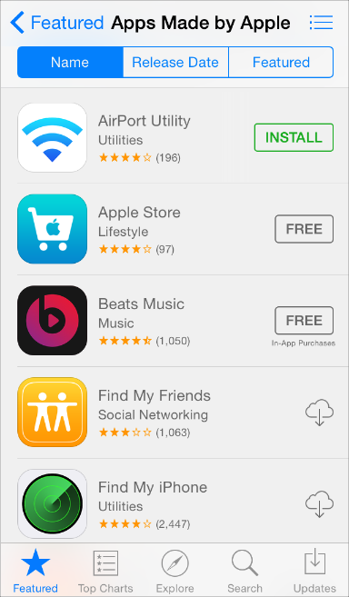

## 1.7 交互性与反馈(Interactivity and Feedback)
### 1.7.1 可交互元素吸引用户点击(Interactive Elements Invite Touch)
为了暗示交互性，设计时会使用很多线索，包括点击的反馈、颜色、位置、上下文、表意明确的图标和标签等。并不需要过于修饰元素来向用户展示可交互性。

在支持 3D Touch 的设备上，当用户按压主屏上的图标时，背景会虚化以此来暗示可以进行更多功能的选择。

一个关键的颜色可以给用户提供很强的视觉指引，尤其是没有冗余的其它颜色时。为了对比，使用蓝色来标记可交互的元素，同时能提供统一的、易识别的视觉风格。

返回按钮使用多个线索指明其可交互并传达其功能:它出现在导航中，显示了一个指向后方的图标，使用了关键色，并且显示了上一级页面的标题。

一个图标或者标题提供了清晰的名称指引用户点击它。例如，地图中的标题“Flyover Tour”，“Directions to Here”，清晰的说明了用户可做的操作。结合关键色，就可以省去按钮边界或其他多余的修饰。

**在内容区域，必要时可以给按钮添加边界或背景。**位于栏(Bar)、动作列表(Action Sheet)和警告框(Alert)中的按钮可以不需要边界，因为用户知道在这种区域中大多数选项是可交互的。但是在内容区域，有必要使用边界或背景将按钮从其他内容中区分出来。例如，音乐，时钟，照片，App Store 在一些特别的场景中使用这种按钮。

照片管理中给分享按钮增加了边框，从其他解释性文本中区分出来。

时钟在秒表和计时页面中给按钮增加背景来强调开始和暂停按钮，并且使按钮在易分散注意力的内容中更容易点击。

应用商店中使用有边界的按钮，将按钮和整个内容条区分开来，点击整条内容查看详细信息，点击按钮进行下载安装。

### 1.7.2 用户所知道的标准手势(Users Know the Standard Gestures)
用户使用点击、拖拽、捏合等手势与应用和他们的 IOS 设备进行交互。使用手势拉近了用户和设备之间的距离，并且增强了直接操纵感。用户通常期待手势在不同应用之间都是通用的。

用户在使用 3D Touch 时不需要学习额外的手势操作。当用户轻按屏幕并得到反馈时，很容易就能发现 3D Touch 提供的额外的交互方式。

除了用户熟悉的标准手势，iOS 还定义了一些系统范围内的操作，例如呼出控制中心(Control Center)或消息中心(Notification Center)。用户可以在任意应用下都使用这些手势。

**不要给标准手势赋予不同的行为。**除非你的应用是游戏，否则重新定义标准手势会使用户迷惑，且增加使用难度。

**不要创建和标准手势功能相似的手势操作。**用户已经习惯了标准手势的行为，没有必要让用户额外学习不同的操作手势来达到同样的操作结果。

**可以用复杂手势作为完成某任务的快捷方式，但不能是唯一触达方式。**最好给用户提供一些简单，直接的方式完成某操作，即使这种方法需要他们额外地多点击一到两次。简单的手势能让用户集中于当前的体验和内容，而不是交互操作本身。

**除非是游戏，否则避免定义新的手势。**在游戏或其他沉浸式的应用中，操作手势也是有趣体验的一部分。但是在普通应用中，帮助用户达成目标要比操作本身重要的多，所以最好使用标准手势，尽量避免让用户去发觉和记忆新的操作。

**在特定的环境中，可以考虑使用多指操作。**虽然复杂的操作并不一定适用于所有应用，但对用户会花大量时间使用的应用来说可以丰富体验，例如游戏或创建内容环境。但因为非标准手势可发现性差，要尽量少用，并且不要让这类手势成为完成任务的唯一方式。

### 1.7.3 反馈有助于理解(Feedback Aids Understanding)
反馈帮助用户了解应用当前在做什么，发现接下来可以做什么以及理解他们动作产生的结果。UIKit 的操作和视图提供了很多反馈类型。

**尽可能将状态或其他的反馈信息整合到 UI 中。**用户不进行操作或不跳出当前内容就能获得需要的信息是最好的。例如，邮箱将当前的状态显示在不影响当前内容的工具栏上。

**避免显示不必要的提醒对话框。**对话框是很强的反馈机制，只有在传递非常重要，且可操作的信息时才需要使用它。如果用户常看到很多没有重要信息的对话框，他们很快就会忽略所有对话框提醒。想要了解更多信息，请参考 [Alert](https://developer.apple.com/library/ios/documentation/UserExperience/Conceptual/MobileHIG/Alerts.html#//apple_ref/doc/uid/TP40006556-CH14-SW2).(译者注：Alert 处在 iOS Human Interface Guidelines 的第4章 UI Elements 部分，翻译将在后续更新中放出，烦请各位耐心等候。若有需要，亦可先参考先前已翻译的 iOS7 UI Elements 章节：下。)

### 1.7.4 输入信息的方式要简单(Inputting Information Should Be Easy)
不管用户是点击控件还是使用键盘，输入信息都会花费时间和精力。如果在发挥有用的效用前就让用户输入大量信息会减弱用户继续使用的欲望。

**让用户更容易的进行选择。**例如，使用选择器或者表格代替纯文本，因为大部分用户觉得从列表中进行选择要比打字容易的多。

**适时地从 iOS 中获取信息。**设备上存储了大量的用户信息。可以的话，不要让用户提供你可以轻易找到的信息，例如联系人或日历信息。

**提供有用的反馈来平衡用户的输入。**在使用应用的过程中，付出和回报的概念可以帮助用户感到进程在被推进。