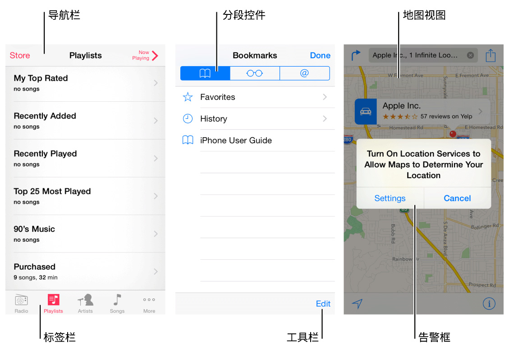
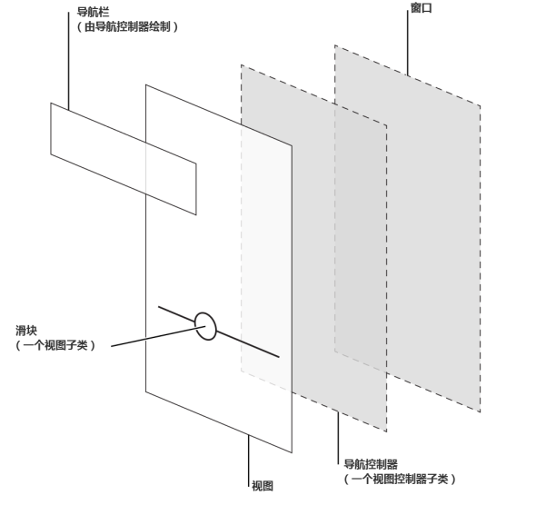

## 1.2 iOS 应用解析(iOS App Anatomy)

几乎所有的 iOS 应用都应用了 UIKit framework 中定义的组件。了解这些基本组件的名称、作用和功能可以帮助你在应用的界面设计过程中做出更好的决策。

UIKit 提供的 UI 组件可以大致分为以下4种类型：

- **栏(Bars)**：包含了上下文信息来指引用户他们所在的位置，以及控件来帮助用户导航或执行操作。
- **内容视图(Content Views)**：包含了应用的具体内容以及某些操作行为，比如滚动、插入、删除、排序等等。
- **控件(Controls)**：用于执行操作或展示信息。
- **临时视图(Temporary Views)**：短暂出现给予用户重要信息或提供更多的选择和功能。
UIKit 除了定义 UI 组件元素，还定义对象如何实现功能，例如手势识别、绘图、辅助功能和打印支持。

从编程的角度来看，UI 组件元素其实是视图的子类，因为它们继承了 UIView。视图能绘制屏幕内容并知道用户何时在其范围内触屏。视图的所有类型有：控件(比如按钮和滑块)、内容视图(比如集合视图和表格视图)，以及临时视图(如警告提示和动作菜单)。

要在应用中管理一组或者一系列的视图，通常需要使用视图控制器。它能协调视图的内容显示，实现与用户交互的功能并能在不同屏幕内容之间切换。比如，“设置”使用了一个导航控制器来展示其视图层级。

这里有一个关于视图与视图控制器如何结合并呈现 iOS 应用的 UI 的例子，如图。

尽管开发者认为真正起到作用的是视图和视图控制器，但一般用户感知到的 iOS 应用是不同屏幕内容的集合。从这个角度来看，在应用里，屏幕内容一般对应于一个独特的视觉状态或者模式。

注：一个 iOS 应用程序包含一个窗口。但是，不同于计算机程序中的窗口，iOS 窗口没有可见的部分并且不能在屏幕上被移动到另一个位置。很多 iOS 应用程序只有一个窗口；可以支持外部显示设备器的应用程序可以有不止一个窗口。

在 iOS Human Interface Guidelines 中，屏幕(screen)这个词和大部分用户理解的一样。作为一个开发者，你也许需要阅读一下其他与 UIscreen 相关的章节，这样你可以更好的了解如何关联外部屏幕。