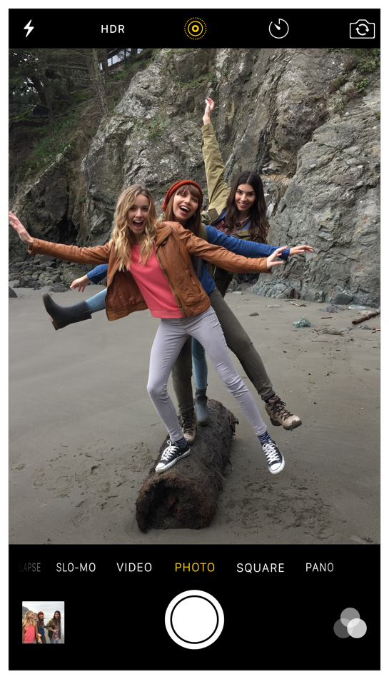
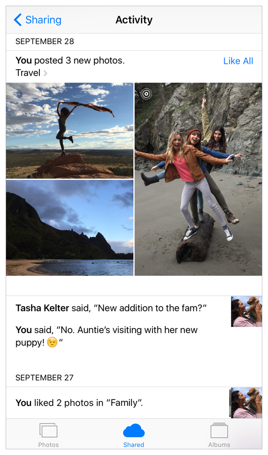

## 3.2 Live Photos
Live Photos 让用户在丰富的声音和动作环境下，捕捉和再现他们喜爱的回忆。从 iOS 9开始，相机(Camera)应用可以捕捉附加的内容(拍照之前和结束后的声音和额外的画面)为传统的、静止的图片增加生活气息。

在 iOS9.1 及之后的版本中，你的应用可以让用户享受和分享 Live Photos。这个指引可以帮助你给用户提供更好的体验。

**在不支持 Live Photo 的环境中，把 Live Photo 像传统照片一样展示。**不要在支持 Live Photos 的环境中，自定一种与 Live Photo 相似的体验。

**不要分开展现Live Photo的附加画面和声音。**要让用户在不同的应用中体验 Live Photos 时，有一致的视觉呈现和交互方式。把 Live Photo 拆分开展现是一个很坏的体验。

**确保用户可以区分 Live Photo 和传统静止图片。**在用户分享照片时，帮助他们做好区分是特别重要的。最好在用户查看一个 LivePhoto 的时候，展现一点移动作为提示。万一这个提示没有起到作用，你可以在 LivePhoto 上展示一个系统提供的标记。LivePhoto 不要展现一个像视频里回放按钮的界面元素。

注意

上图这种情况，不支持像照片应用里全屏浏览滑动切换照片时的显示的

**把用户所做的调整应用到 Live Photo 的所有帧中。**如果你的应用可以让用户为照片添加滤镜或者调整，应确保它可以作用于整个 LivePhoto 中。如果你不支持调整用户想分享的 LivePhoto 的所有内容，要让他们知道可以以传统照片的方式分享。 让用户在决定分享前，**可以预览这个 Live Photo 的所有内容。**如果你的应用 UI 可以让用户选择照片分享，要为他们提供一个把 Live Photo 作为传统照片分享的方式。 如果你使用系统提供的标记，应该把它放在每个 LivePhoto 上同样的位置。标记可以放在一个不会影响用户查看照片的角落。确保在你的应用中采用一致的方式添加标记，这样可以让用户依靠它去识别 LivePhoto。iOS 有两种方式提供标记：

- 覆盖。这种覆盖的方式包含一个阴影，适合覆盖在照片上
- 纯色。这种纯色的方式(无阴影)可以被用来创建一个可调色的图片模板
- iOS 也提供了很多纯色标记，其中，图片上一个删除线代表现在的 LivePhoto 被当做是一个传统的照片
**在用户下载一个 Live Photo 的时候给他们一个好的体验。尤其重要的是，**用户需要知道他们正在下载的是一个 LivePhoto，他们需要知道什么时候可以播放它。如果你为一个 Live Photo 展示一个未播放的进度指示器，确保这个指示器与你的应用中其他的下载体验一致。