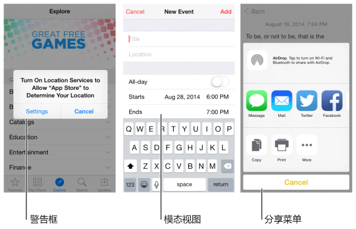

## 1.6 模态情境(Modal Contexts)
模态是一个承载某些连贯操作或内容的优缺点并存的模式。它可以给用户提供一种不脱离主任务的方式去完成一个任务或者获得信息，但是也会临时性的阻止用户对应用的其他部分进行交互操作。

理想情况下，用户可以与 iOS 应用进行一种非线性的交互，所以，尽可能的减少你应用中的模态体验是最好的。通常情况，仅在以下情境可以考虑使用模态：

- 必须引起用户关注的时候
- 一个独立的任务需要完成或者很明确需要被放弃，为了避免在模棱两可的状态下遗漏用户信息的时候
**保证模态任务简单、简短和高度聚焦。**你肯定不希望用户使用模态视图时像使用应用中的一个 mini 应用一样。如果子任务过于复杂，用户会在进入模态情境时忽略了主要任务。在设计一个涉及视觉层次的模态任务时特别要考虑这一点，因为用户有可能迷失并且忘记如何回到之前的操作中去。如果一个模态任务必须包含不同视图的子任务，确保给用户一个独立、清晰的导航路径，并避免迂回。更多关于模态试图的信息请参考 [Modal View](https://developer.apple.com/library/ios/documentation/UserExperience/Conceptual/MobileHIG/Alerts.html#//apple_ref/doc/uid/TP40006556-CH14-SW3).

**始终提供明显、安全的退出模态任务的途径。**确保用户在退出模态视图时可以预期操作的结果。

**一个任务需要多层级的模态视图时，**确保用户理解点击非最高层级下的完成按钮的结果。点击一个低层级视图上的完成按钮是完成这个视图中任务的一部分，还是整个任务。因为有可能存在这种困惑，所以要尽可能避免在下级视图中添加完成按钮。

**保证提醒对话框的内容都是必要且可操作的。**提醒对话框会打断用户的体验并且要点击才会消失，所以要让用户感到提醒信息是有用的，打断是有价值的。想要了解更多请参考 [Alert](https://developer.apple.com/library/ios/documentation/UserExperience/Conceptual/MobileHIG/Alerts.html#//apple_ref/doc/uid/TP40006556-CH14-SW2).

(译者注：上文提到的 Modal View 与 Alert 均处在 iOS Human Interface Guidelines 的第4章 UI Elements 部分，翻译将在后续更新中放出，烦请各位耐心等候。若有需要，亦可先参考先前已翻译的 iOS7 UI Elements 章节：上，下。)

**尊重用户关于接收通知的偏好设置。**用户会设置接收应用通知的形式，确保遵重用户的喜好设置，否则可能会触怒用户，导致其关闭应用中所有的推送通知。