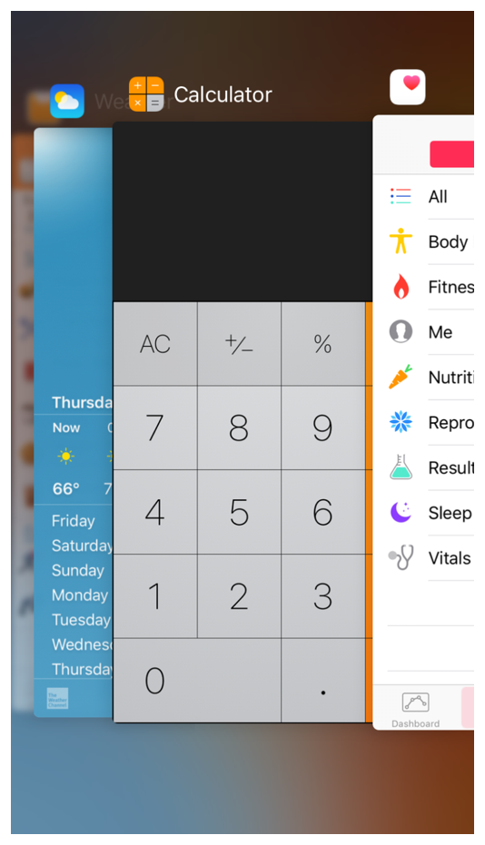

## 3.8 多任务处理(Multitasking)
多任务处理让人们在屏幕上(在合适的 iPad 模式上)查看多个应用，可以在最近使用的应用之间进行快速切换。在 iOS9,中，人们可以使用多任务处理 UI(下图所示)去选择最近使用的应用。

能否在多任务处理中处理好取决于能否在设备中与其他应用和谐共存。从更高的层面来说，这意味着所有的应用都应：

- 仔细调整资源使用避免占用太多 CPU，内存，屏幕空间和其他资源
- 处理好中断或来自其他应用的声音
- 停止和重启，即快速平滑地从后台切换到前台
- 不在前台时应恪守己任
下述指南细则可以帮助你的应用在专注应用切换的多任务处理中取得成功。更多合格的 iPad 模式下关于多任务环境中运行的信息，参阅 [Adopting Multitasking Enhancements on iPad](https://developer.apple.com/library/ios/documentation/WindowsViews/Conceptual/AdoptingMultitaskingOniPad/index.html#//apple_ref/doc/uid/TP40015145).

**准备好被打断，并恢复。**多任务处理增加了后台应用中断你的应用的可能性。其他特性，诸如广告出现和更快的应用切换，也会造成更频繁地打断。越快速和越精确地保存应用当前状态，人们就可以越快地重新运行应用，并从之前离开的页面继续使用。你可以通过利用 UIKit 的状态保存和恢复来为用户提供无缝的重新开始的体验(查看 [Preserving Your App’s Visual Appearance Across Launches ](https://developer.apple.com/library/ios/documentation/iPhone/Conceptual/iPhoneOSProgrammingGuide/StrategiesforImplementingYourApp/StrategiesforImplementingYourApp.html#//apple_ref/doc/uid/TP40007072-CH5-SW2)了解更多信息)。

**确保你的 UI 可以处理两倍高度的状态栏。**两倍高度的状态栏会在诸如通话、录音和共享等过程中出现。在未作处理的应用中，状态栏的额外高度会引起布局问题，如 UI 被向下挤压或者被遮住。在多任务处理环境中，使两倍高状态栏显示正常是格外重要的，因为它可能会出现在更多的应用当中。

**准备好暂停需要人们注意或主动参与的活动。**例如，如果你的应用是一款游戏或媒体观看应用，你需要确保你的用户从应用切换走时，不会丢失任何内容或事件。当人们切换回游戏或媒体播放器时，他们希望能继续之前的体验，就好像他们从未离开过应用。

**确保音频行为合适。**当你的应用正在运行时，多任务处理会使得其他媒体活动更可能地同时进行，也会有更多可能性使你的音频不得不暂停，并恢复处理中断。查看[声音](https://developer.apple.com/library/ios/documentation/userexperience/conceptual/mobilehig/Sound.html#//apple_ref/doc/uid/TP40006556-CH44-SW1)来帮助你确保你的音频能满足人们的期望，并与设备中的其他音频和平共处。

**适度使用本地通知。**应用可以在特定时间发送本地通知，无论应用是在暂停中还是运行中亦或是根本就没有运行。为了达到最好的用户体验，应避免用过多的通知来骚扰人们，并遵循[通知](https://developer.apple.com/library/ios/documentation/userexperience/conceptual/mobilehig/NotificationCenter.html#//apple_ref/doc/uid/TP40006556-CH39-SW1)中创建通知内容的指南。

**必要时，在后台完成用户的任务。**当人们开始一个任务时，他们通常会期望即使已经从应用中切换走了任务仍能够完成。如果你的应用在执行用户任务途中，并且这个任务不需要额外的用户交互，那么你就应该在应用挂起之前就在后台完成任务。