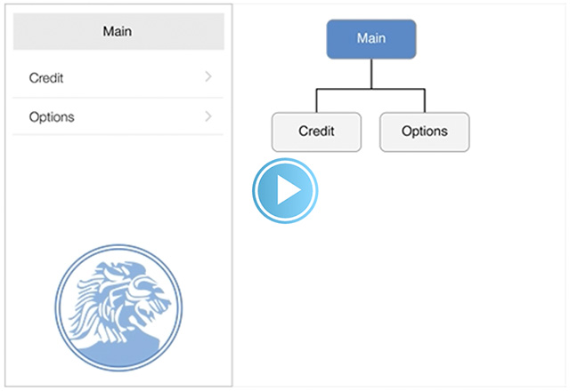
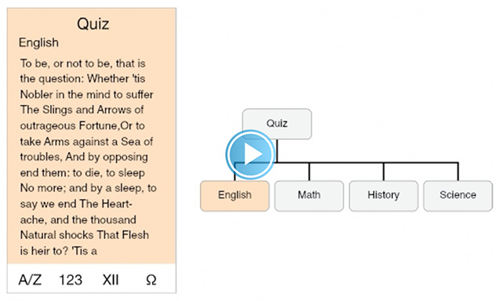
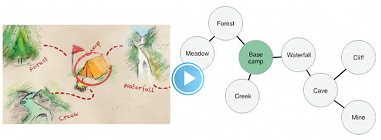

## 1.5 导航(Navigation)
除非导航设计不合理，不然用户应该明显察觉不到应用中的导航体验。导航设计应该能够支撑你应用结构和目的却又不分散用户注意力。
广义来说，导航主要有以下几种类型，每个导航都有其适应的应用结构：

- 分层
- 扁平
- 内容或体验驱动
在有层级结构的应用中，用户在每个层级中都要选择一项，直到到达目的层级。如果要切换到另一个目的层级，用户必须回退一些层级，或者直接回到初始层级再次选择。系统设置和邮箱应用在这方面是很好示范，可以参考他们。

译者注：以上为视频截图，完整视频可点击观看。

在扁平信息架构的应用中，用户可以从首页目录直接切换到另一个，因为所有的分类都可以从主屏直接访问。音乐和 App Store 是两个使用扁平结构的好例子。

译者注：以上为视频截图，完整视频可点击观看。

在内容或体验驱动的信息架构应用中，导航也会根据内容或体验来设计。例如，在阅读一本电子书时，用户会一页接一页的进行阅读，或者直接从目录中选中某一个指定的页码；同样，在游戏中导航也是体验的重要组成部分。

译者注：以上为视频截图，完整视频可点击观看。

在某些情况下，在一个应用中结合多种导航类型会有很好的效果。例如，对于扁平信息结构中某一分类下的内容，用分层导航的方式来显示可能会更好。

**应该让用户时刻清楚自己当前在应用中所处的位置，及如何前往目的页面。
**无论使用哪种适合你的应用结构的导航，最重要的是用户访问内容的路径要有逻辑、可预期和易于追溯。

UIKit 定义了一些标准的 UI 元素，以方便地构建分层或扁平导航，还有一些元素可以构建以内容为中心的导航，例如电子书或者媒体观看类应用。游戏或者其他体验驱动的应用通常需要一些自定义的元素和行为。

**使用导航栏(Navigation Bar)帮助用户轻松访问分层内容。
**导航栏的标题可以显示用户当前所处的层级，而后退按钮可以回到上一层级。想要了解更多内容，请查看 [Navigation Bar](https://developer.apple.com/library/ios/documentation/userexperience/conceptual/mobilehig/Bars.html#//apple_ref/doc/uid/TP40006556-CH32-SW3).

**使用标签栏(Tab Bar)显示同类型的内容或功能。
**标签栏很适合于扁平信息结构，可以让用户在分类之间随意切换，而不用在意当前所处的位置。想要了解更多内容，请查看 [Tab Bar](https://developer.apple.com/library/ios/documentation/userexperience/conceptual/mobilehig/Bars.html#//apple_ref/doc/uid/TP40006556-CH32-SW52).

**在应用中，如果每屏显示的都是同类项或同类页，可以使用页面控件(Page Control)。
**页面控件的优点是可以直观地告诉用户有多少个项目或页面，以及当前所处位置。想要了解更多内容，请查看 [Page Control](https://developer.apple.com/library/ios/documentation/userexperience/conceptual/mobilehig/Controls.html#//apple_ref/doc/uid/TP40006556-CH35-SW6)。

**一般来说，最好能给用户提供到达每一屏的唯一路径。
**如果某屏内容用户需要在不同场景下查看，可以考虑使用临时视图，例如模态视图、动作菜单或警告框。想要了解更多，请查看 [Modal View](https://developer.apple.com/library/ios/documentation/userexperience/conceptual/mobilehig/Alerts.html#//apple_ref/doc/uid/TP40006556-CH34-SW3)、[Action Sheet](https://developer.apple.com/library/ios/documentation/userexperience/conceptual/mobilehig/Alerts.html#//apple_ref/doc/uid/TP40006556-CH34-SW36) 和 [Alert](https://developer.apple.com/library/ios/documentation/userexperience/conceptual/mobilehig/Alerts.html#//apple_ref/doc/uid/TP40006556-CH34-SW2)。

UIKit 同时还提供了以下相关控件：

- [分段控件(Segmented Control)](https://developer.apple.com/library/ios/documentation/UserExperience/Conceptual/MobileHIG/Controls.html#//apple_ref/doc/uid/TP40006556-CH15-SW27)。分段控件让用户在一屏内就可以查到不同分类的内容，而不需要切换到其他屏幕。
- [工具栏(Toolbar)](https://developer.apple.com/library/ios/documentation/UserExperience/Conceptual/MobileHIG/Bars.html#//apple_ref/doc/uid/TP40006556-CH12-SW4)。尽管工具栏和导航栏或标签栏相似，但是工具栏不具导航作用。相反，工具栏为用户提供了可以控制当前屏幕内容的控件。
(译者注：上文提到的 Navigation Bar, Tab Bar, Page Control, Modal View, Action Sheet, Alert, Segmented Control 和 Toolbar 均处在 iOS Human Interface Guidelines 的第4章 UI Elements 部分，翻译将在后续更新中放出，烦请各位耐心等候。若有需要，亦可先参考先前已翻译的 iOS7 UI Elements 章节：上，下。)