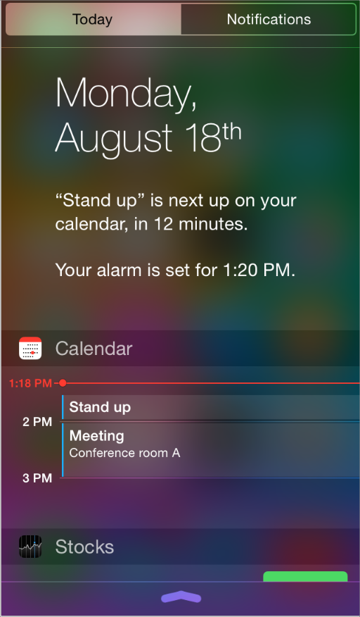
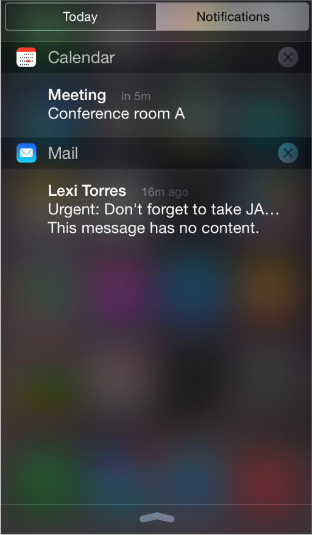
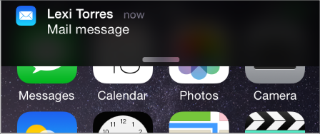
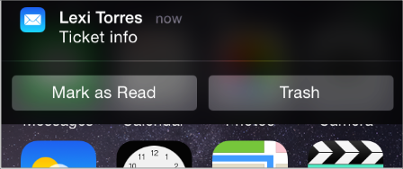
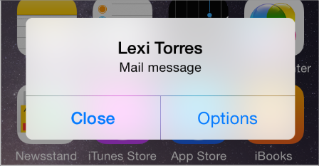
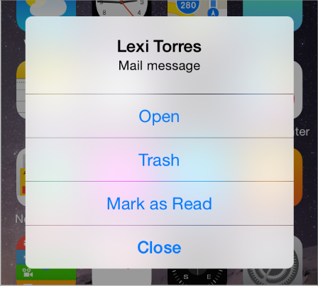
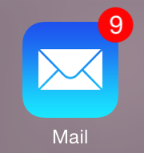

## 3.9 通知(Notifications)
通知为人们提供即时的重要信息和功能。人们能在多种情况下收到通知，例如在锁屏界面中，或者在使用应用时，或者访问通知中心时。 通知中心有两种视图：通知(Notifications )和今天(Today)。

今天视图显示了一组可编辑的部件。今天部件是一个应用扩展，显示了少量及时和重要的信息或功能，这些信息或功能则是由用户所关注的应用所提供。举例来说，日历部件只显示了今天的事件。点击日历部件中的一个事件可以唤起日历应用，并打开该事件，用户接下来可以编辑该事件或管理其他的事件。想要了解更多关于设计今天部件的内容，请参见[今天部件](https://developer.apple.com/library/ios/documentation/userexperience/conceptual/mobilehig/AppExtensions.html#//apple_ref/doc/uid/TP40006556-CH67-SW4)。

通知视图会显示用户感兴趣的应用所发出的最近通知。用户可以在设置(Settings)中来设置是否在通知中心显示该应用的通知。 iOS 应用可以使用通知来让人们知道一些有趣的事情是什么时候发生的，例如：

- 收到一条消息
- 事件即将发生
- 有新的数据可下载了
- 某些状态发生了变化
在 iOS8 及之后的版本中，应用可以定义用户在通知中的操作。例如，用户可以在待办事项应用的通知中就标记该事项已完成，而无需额外打开应用。 iOS 定义了两种类型的通知。

- **本地通知(local notification)**由应用安排待发送，最终通过 iOS 发送到同一设备中，无论该应用当前是否正在后台运行。例如，日历或待办事项应用可以安排一条本地通知来提醒人们一个即将到来的会议或者日期。
- **远程通知(remote notification)**(也称为**推送通知(push notification)**)是由应用的远程服务器通过苹果推送通知服务来发送的，这类通知最终会被推送到所有安装了该应用的设备。例如，一款在线竞技类的游戏，用户可以和其他玩家竞赛的，可以更新所有玩家的最新状态。
注意：应用扩展可能会要求远程通知必须发送到它的容器应用。在这种场景下，容器应用常常会在后台运行来处理通知。想要了解更多关于应用扩展的内容，请参见应用扩展。

如果当你的应用正在后台运行时收到了本地或远程的通知，你就应该以你的应用所特有的方式将信息传达给你的用户。 为了确保用户能够自定义他们的通知体验，你应该尽可能多地支持以下的通知类型：

- 横幅(Banner)
- 警告框(Alert)
- 小气泡(Badge)
- 声音(Sound)
注意：在 iOS8 及之后的版本中，你必须对所有你想发送给用户的通知类型进行注册。当你第一次进行注册动作时，用户会遇到一个警告框，他们可以在其中操作来决定允许或拒绝所有来自你的应用的通知。不管用户选择的结果是什么，他们应始终能访问应用的设置来更改此项设置，或者设置他们想要接收的通知类型。

横幅(banner)是一个小而透明的视图，会出现在屏幕顶部并在几秒后消失。用户还可以看到在锁屏当中的横幅以及在通知中心中以通知形式出现的横幅。在横幅中，iOS 会显示通知的内容和应用的小图标(欲了解更多关于小图标的内容，请参见 [App Icon](https://developer.apple.com/library/ios/documentation/userexperience/conceptual/mobilehig/AppIcons.html#//apple_ref/doc/uid/TP40006556-CH19-SW1))。用户点击横幅来隐藏显示并切换到发送通知的应用。

除了默认的点击动作之外，当用户轻扫横幅时,你还可以定义两个动作按钮。点击通知动作按钮来隐藏横幅的显示并启动你的应用(可能是在后台)来执行动作。

通知**警告框**是显示在屏幕上的标准警告框视图，需要用户操作后才会隐藏。当用户点击 Options 按钮后，你需要提供并显示通知消息以及任何一个默认动作，或最多四个特定动作。警告框的背景样式不能做修改。 当用户点击警告框中的一个默认或自定义动作按钮时，iOS 会同时隐藏警告框并运行你的应用(可能是在后台)。点击关闭或确定按钮会隐藏警告框而不打开应用。

**小气泡(badge)**是一个显示未读通知数量的红色小圆(小气泡显示在应用图标的右上角)。小气泡的大小和颜色不能做修改。 横幅、警告框和小气泡这三种通知都可以使用自定义或系统提供的**声音**。

**在通知中谨慎使用具破坏性的动作。**要确定用户有足够的上下文来避免意想不到的后果。为了帮助用户区分你所定义的破坏性动作，iOS 会用红色来显示它。有时候，在应用执行破坏性动作之前，应该请求用户进行确认。举个例子，如果在锁屏的横幅(banner)中提供了一个破坏性动作，那么就应确保只有设备的主人才能执行该动作(你需要在代码上实现这一需求)。

**为每个动作按钮提供自定义标题。**创建一个简短的标题来描述清楚将要发生的动作。例如，游戏可能会使用“Play”作为标题来表明，点击这个按钮会打开应用来进行游戏。确保标题：

- 使用标题样式的大小写(title-style capitalization)
- 足够简短，能不被截断地显示在按钮内(也应确保测试各种语言文字的标题显示正常)
**不要为同一个事件重复发送通知。**用户可以选择处理通知项；通知项在用户未处理前会一直显示。如果为同一事件重复发送通知，通知中心列表中会满是通知，用户就有可能会关闭你的应用的通知。

不要在通知消息中包含你的应用名称。自定义信息会在警告框和横幅中显示，也会在通知中心中以通知的形式显示。你无需在自定义信息中显示你的应用名称，因为 iOS 会在显示信息的同时自动显示应用名称。 为了使本地或远程通知信息更有作用，你应该：

- 专注于信息而不是用户的行为。避免告诉人们点击哪个按钮或如何打开你的应用
- 足够简短，一两行就可以显示完整。较长的信息对于用户来说很难进行快速阅读，也会造成在警告框中需要滚动才能查看完整
- 使用句式大小写(sentence-style capitalization)，并配以合适的结束语句符号。可能的时候，可以使用一个整句
注意：如有必要，iOS 会缩短你的消息以便能在各种通知发送样式下显示；为了最好的效果，你不应主动缩减你的消息。

**保持小气泡的内容是最新的。**当用户注意到新信息时，即时更新小气泡非常重要，这样用户就不会觉得收到了额外的通知。注意，当小气泡为0时也会移除通知中心中所有对应的通知项。

重要：不要使用小气泡做通知以外的用途。记住，用户能够关闭应用的小气泡，所以你无法确定他们一定能看到小气泡中的内容。

**当收到通知时，提供用户可以选择听到的音效。**当人们没有在看屏幕的时候，可以通过音效获取他们的注意。例如，日历应用可能会在显示警告框的同时播放一个音效来提醒人们一个即将到来的事件。再如，协作任务管理应用可能会在小气泡更新时播放一个音效来告知某个远程协同的同事已经完成了某个任务。

你可以提供自定义的音效，或者使用内置的警告音。如果你创建了自定义音效，请确保它是简短的、有特色的并且是经由专业制作的。(想要了解更多关于音效的技术需求，请参阅 [Local and Remote Notification Programming Guide ](https://developer.apple.com/library/ios/documentation/NetworkingInternet/Conceptual/RemoteNotificationsPG/Introduction.html#//apple_ref/doc/uid/TP40008194)中的 [Preparing Custom Alert Sounds](https://developer.apple.com/library/ios/documentation/NetworkingInternet/Conceptual/RemoteNotificationsPG/Chapters/IPhoneOSClientImp.html#//apple_ref/doc/uid/TP40008194-CH103-SW6)。)注意，当通知发送后，你无法以编程方式来触发设备的震动，因为用户对于警告框是否伴随震动拥有支配权。