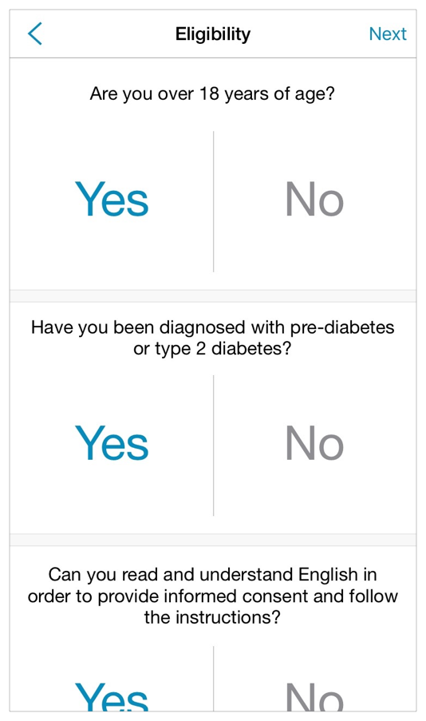
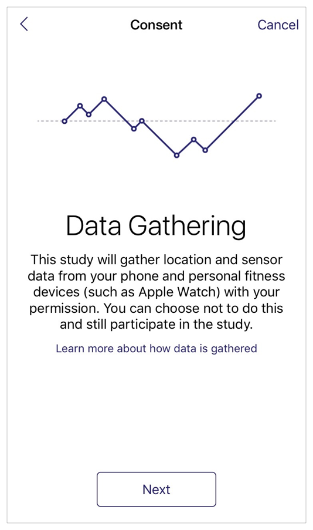
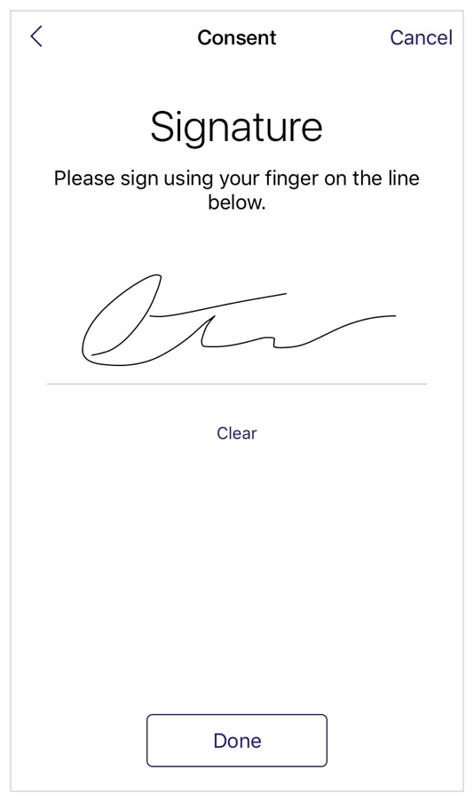
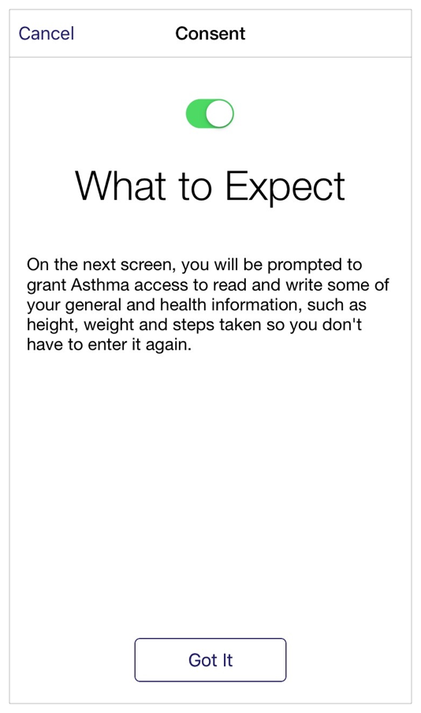
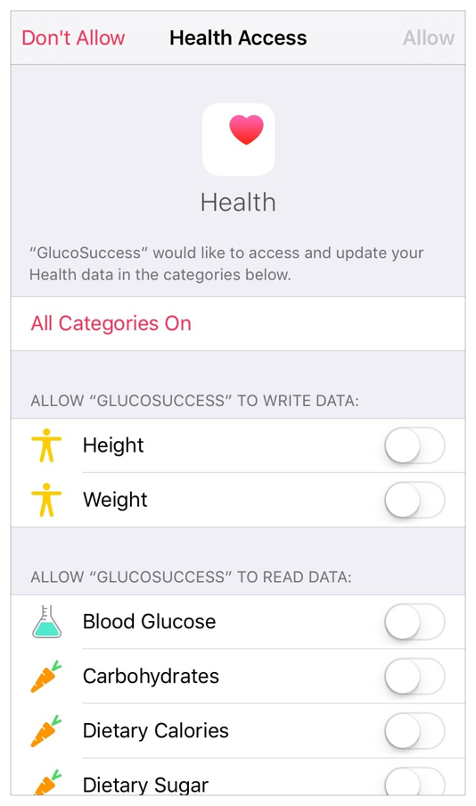

## 3.5 研究型应用程序(Research Apps)
研究型应用程序可以让苹果用户充分利用 iOS 移动设备的便利性，参与到各种研究性学习中来。通过调用开源代码 ResearchKit，使用预设的几种界面视图和转场动画，可以很轻易为你的研究和参与者自定义一个美观易用的研究型应用程序，这些资源都可以在苹果的开源代码 ResearchKit 项目中调用。要想了解如何使用 ResearchKit 来为你的研究开发一个研究型应用程序，请查阅 [researchkit.org](researchkit.org).

重要

这些规范准则仅供参考之用，并不构成任何法律意见。对于与你的研究型应用程序发展以及任何法律适用的相关建议，你应该向律师咨询。

通常情况下，一个研究型应用程序是由 ResearchKit 定制化的界面视图以及应用程序本身具体设定的界面视图组成，可归纳为三种主要的体验：

- 参与者的就位培训(Onboarding)
- 研究性调查(Study-specific investigation)
- 管理条目信息(Management items)
设计你的研究型应用程序时务必要遵循以下每个部分的规范准则，将有助于你的用户参与者感到舒服和保持参与感。

### 3.5.1 参与者的就位培训(Onboarding)
就位培训的体验包含了一系列向潜在参与者介绍研究内容以及征询他们同意的环节。完成这些以后，参与者通常不会再重新访问这些就位培训的内容环节：

你应该按如图所示的这个顺序呈现就位培训的各个体验环节，也就是按介绍指引、适任、知情同意，以及授权访问数据。

**创建一个具有号召性用语的介绍指引。**指引环节应该帮助人们了解更多关于你的研究以及告诉他们如何成为一名参与者。指引环节最好也能向那些现有的参与者提供快捷登录的入口以便继续正在进行的研究。

**尽快确认招募的用户是否合格。**适任环节呈现在指引环节之后、知情同意环节之前(如果参与者并不适合该研究则没有必要让其查看知情同意环节)。请确认所呈现的适任资质要求对于你的研究来说是必要的。请使用简单、直白的语言描述这些要求，并让用户可以很容易就输入相关信息。

**在得到参与者的同意之前，确保他们已充分了解你的研究内容。**ResearchKit 有助于让知情同意流程显得简洁、友好，同时还允许将你同意的任何法律规定或由机构审查委员会和伦理审查委员会所设定的规定纳入其中。(如果你的应用程序涉及到进行人体生物学相关的研究，必须确保你的应用程序符合现有的苹果应用商店规范指南，并获得参与者的许可。)通常情况下，知情同意环节包含了：

- 说明这项研究是如何工作的
- 确保参与者了解研究内容以及各自的责任
- 获得参与者的许可
**将冗长的同意书分解成易理解消化的小节。**每个小节可以只覆盖研究内容的一个方面，比如数据采集、数据应用、潜在好处、可能的风险、时间承诺、如何撤出等等。每个小节请使用简洁、直白的语言来说明一个高度概括的内容。如果有必要，提供一个查看详情的按钮便于参与者了解该小节更详细的解释。应该让他们在同意参与之前，就查看完全部知情同意内容。

**通过一个小测验来测试参与者的理解情况是有意义的。**在获得参与者允许的情况下，你可以选择向每个参与者询问相同的问题。

**你的研究必须获得参与者的同意，如果合适，还可以收集一些联系人信息。**参与者同意参与研究后，他们需要提供个人签名以及联系方式，最后会收到一个确认对话框。对于这些信息记录，大多数的研究型应用程序会向参与者电邮一份 PDF 格式的同意书。

参与者需要对这个确认自愿参与研究的告警对话框给予响应

参与者可以提供他们的个人签名在知情同意流程中

**如果你需要访问参与者的设备或数据必须得到他们的许可。**必须解释清楚你的研究型应用程序为什么需要访问他们的位置信息、健康应用程序或其他数据，并且确保避免向参与者索要对你研究并非至关重要的数据。同样地，如果你需要向参与者发送通知提醒也要获得参与者的许可。

让参与者准备授权访问数据，比如健康应用程序的数据

让参与者自己选择他们愿意与你共享的数据

### 3.5.2 具体研究的调查(Study-Specific Investigation)
为了从参加者获得数据输入，你的研究可能会使用情况调查、活动任务，或两者的组合。根据你的研究的体系结构，参与者可能会在每个环节多次或仅需完成一次交互即可。

**问卷调查的设计应该能让参与者专注参与其中。** ResearchKit 可以很容易就呈现多种答案类型的调查问题，比如对错、多选、日期和时间、比例计算，以及开放式文本填写。当你使用 ResearchKit 的界面视图来创建一项调查，请遵循以下准则，来保证好的用户体验：

- 告诉参与者总共有多少道问题，以及完成调查预计需要花费的时间
- 每屏只呈现一道问题
- 显示给参与者当前调查的进度
- 调查应该尽可能简短。几个简短的调查往往好于一个冗长的调查
- 对于需要额外解释的问题，问题描述请用标准字体大小，然后解释文字用略小的字体大小
- 调查结束时要告知参与者
ResearchKit 提供了许多用于调查环节的可自定义界面视图。这里有一些样例。

**使得活动任务容易理解。**活动任务需要参与者参与到一次活动中来，比如对着麦克风语音、手指在屏幕上完成点击、行走散步，以及执行一次记忆力测试。请按照以下几点准则来鼓励参与者执行活动任务，并给与他们成功的绝佳机会：

- 请用简洁易懂的语言来描述如何执行本次任务。
- 如果任务必须在特定的时间或特定情况下进行，请务必明示。
- 确保参与者可以分辨出任务何时结束。
以下是 ResearchKit 所支持的两个活动任务样例。

### 3.5.3 管理条目信息(Management Items)
ResearchKit 提供了个人档案的界面视图来让参与者可以管理他们的个人信息。此外，创建一个可以激励用户并能让他们追踪他们在研究中的进度的界面视图是个不错的选择。在大多数情况下，参加者应该能够随时访问这两个模块。

**使用个人档案来帮助参与者管理个人信息和与你研究相关的数据。**个人档案界面视图允许参与者在研究进程期间可以编辑相应数据，比如体重或睡眠习惯，并且可以提醒他们即将到来的活动任务。你同样可以在个人档案中给予参与者一种简单的方式离开该研究、查看知情同意书，以及查看该应用程序的隐私政策。

**使用仪表盘概览视图来激励参与者，并呈现进度。**一个概览视图可以让你与参与者对信息一览无余并鼓励他们继续参与。如果你的研究内容合适的话，你可以使用该概览视图给予参与者丰富的反馈，比如每日进度、每周评估、具体活动的结果，以及同其他参与者的汇总结果进行对比。

