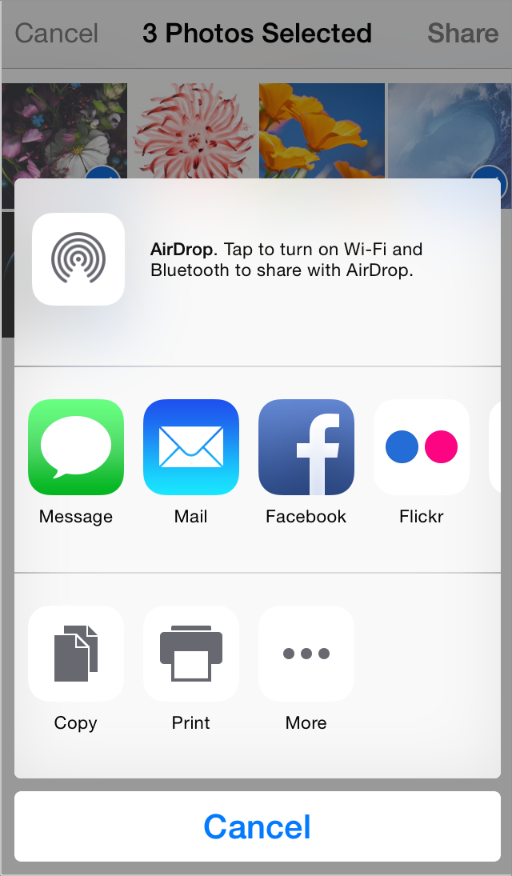

3.10 社交媒体(Social Media)
人们会期望在任何场景下都可以使用他们喜爱的社交媒体帐号。iOS 以人们喜欢的方式将社交媒体的交互与你的应用进行了整合。

注意：当用户点击动作按钮时，他们会得到一个如上图的动作视图控制器。想要了解更多关于这个视图控制器的内容，请参见 [Activity View Controller](https://developer.apple.com/library/ios/documentation/UserExperience/Conceptual/MobileHIG/ContentViews.html#//apple_ref/doc/uid/TP40006556-CH13-SW121)。

动作视图控制器的中间一行显示了用户启用的和系统提供的分享应用扩展。想要了解更多关于设计分享扩展的内容，请参见 [Share and Action Extensions](https://developer.apple.com/library/ios/documentation/UserExperience/Conceptual/MobileHIG/AppExtensions.html#//apple_ref/doc/uid/TP40006556-CH67-SW3)。

**考虑在你的应用中为用户提供一种简便的方式来撰写邮件。**用户有可能会启用分享扩展以便能在任何地方都可以发送内容。但是你也可以使用系统提供的撰写视图控制器来呈现给用户，他们可以在其中进行编辑操作。你可以在显示给用户进行编辑之前，预先加载具有自定义内容的撰写视图(在你呈现给用户之后，只有用户可以编辑这些自定义内容)。想要了解更多关于社交框架(Social framework)的编程界面，包括 [SLComposeViewController](https://developer.apple.com/library/ios/documentation/NetworkingInternet/Reference/SLComposeViewController_Class/index.html#//apple_ref/occ/cl/SLComposeViewController) 类，请参见 [Social Framework Reference](https://developer.apple.com/library/ios/documentation/Social/Reference/Social_Framework/index.html#//apple_ref/doc/uid/TP40012233).

**如果可能，避免要求用户登录进入一个社交媒体账户。**社交框架(Social framework)会和帐号框架(Accounts framework)一起来支持一个单点登录模式，所以你可以获得授权来访问用户的帐号，而无需要求他们来重新授权。如果用户还没有登录进入一个帐号，你可以显示 UI 来让他们进行登录。