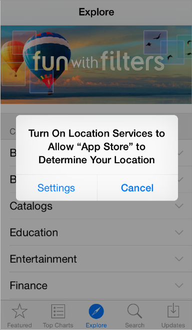

## 1.4 启动与停止(Starting and Stopping)
### 1.4.1 即时启动(Start Instantly)
我们通常认为用户不会花超过一两分钟去评价一款新应用。当你可以最大程度地利用这段极短的时间，即时呈现对用户有帮助的内容时，你就能够激发新用户的兴趣并给所有用户一种极棒的体验。

重要：不要在安装过程结束后告诉用户需要重启设备。重启需要花费时间，同时也会让人觉得你的应用不可靠且很难使用。
如果你的应用有内存使用或其它问题，导致不重启就无法流畅运行，你必须声明这些问题。想要了解如何开发一款性能良好的应用，请参阅 [Use Memory Efficiently](https://developer.apple.com/library/ios/documentation/iPhone/Conceptual/iPhoneOSProgrammingGuide/PerformanceTips/PerformanceTips.html#//apple_ref/doc/uid/TP40007072-CH7-SW8).
尽可能避免使用闪屏或者其他启动体验方式。用户能够在启动应用后立即开始使用是最好不过的。

**尽可能地，避免让用户做过多设置。**而应该如此：

- **聚焦在80%目标用户的需求上。**这样绝大部分用户就无需设置各种选项，因为你的应用已经默认处于他们想要的状态。如果有些功能仅有少部分用户想要，或者是大部分用户只需要使用一次，那就别管它了。
- **尽可能用其他方式获取更多的用户信息。**如果你能得到用户在内置应用或硬件设置中提供的信息，直接从系统中获取，不要让用户再次输入。
- **如果你必须要求用户设置用户信息，在你的应用中直接提示用户输入。**然后尽快保存这些设定(一般来说，保存到你的应用的设置模块中)。这样用户就无需强制跳出应用进入系统设置页面了。如果用户需要更改设置，他们可以在任何时候进入应用的设置模块进行修改。
**尽可能让用户晚一点再登录。**最理想的状态是，用户在无需登录的情况下就能尽量多地浏览内容并使用部分功能。例如，App Store 会在用户确定进行购买商品时，才要求用户进行登录。对于那些强制用户登录后才能进行一切有用操作的应用，用户往往会直接放弃。

如果你的应用必须先登录后使用，那么你应该在登录页面有一些简短的文字，来描述为什么必须先登录，以及这样做会给用户带来什么好处。

**谨慎使用新手引导**(介绍应用的功能和如何进行操作)。在考虑新手引导之前，你应该努力地完善你的应用，尽可能使应用的功能直观和易于寻找。其实，好的应用不需要新手引导。如果你确实觉得需要新手引导，那么请参考如下的建议，设计一个简洁、有针对性并且不妨碍用户的新手引导。

- **只提供开始使用应用所必需的信息。**好的新手引导应该告诉用户第一步应该做什么，或者简短地演示大部分用户感兴趣的一些功能。如果在能够探索你的应用之前，给用户展示太多信息，让用户记住这些不是当前所必须的内容，会让用户觉得你的应用很难用。如果在某些特定场景下确实需要额外帮助，那么也应该只在用户处于这个场景之后再提供。
- **使用动画和可交互的方式来吸引用户，并让用户通过实际操作来学习如何使用。**对于文字内容的增加应该谨慎，且仅当增加文字对于提升体验有益时才这么做。不要指望用户会阅读大段的文字。例如，可以使用动画而不是文字来描述如何执行一个简单的任务。在引导用户了解较为复杂的任务时，可以通过一些引导浮层来简要说明每一个步骤用户需要做什么。尽可能避免展示应用截图，因为截图不可交互的，用户可能会混淆截图和应用的实际界面。
- **能够让用户很容易地取消或者跳过新手引导。**有些用户看完新手引导之后就不想再看，有些甚至根本就不想看新手引导。请记住用户的选择，不要强迫用户每次打开你的应用都要再选择一次。

**不要太早要求用户去给你的应用评分。**过早要求用户进行评分可能会适得其反。如果你想获得有价值的反馈和评论，在邀请用户评论之前，请给他们一点时间来使用你的应用，并对你的应用形成印象。例如，你可以等用户访问了一定数量的页面或完成了一定数量的任务之后，再邀请他们进行评价。

**一般建议按照屏幕默认的定向方式启动你的应用。**尽管如此，如果你的应用只有一种屏幕方向，那么就始终以这个方向启动，让用户在他们自己需要时再改变设备方向。例如，一个游戏或者媒体观看应用只在横屏模式下运行，那么就应该以横屏模式启动，即使设备当前处于竖屏模式。这样的话，如果用户在竖屏模式下打开应用，他们也知道应该把设备转成横屏来进行使用。

注：最好让横屏应用支持两种方向的横屏，即 home 键在左或在右方都支持。如果设备当前已经处于横向状态，那么就按照当前状态启动应用，除非你有充分的理由不这么做。其他情况时，可以考虑按 home 键处于右侧的方式启动应用。(想要了解更多关于支持不同设备方向的内容，请参阅前文中 Adaptivity and Layout 相关章节。)

**提供一张与应用首页看上去一样的闪屏。**iOS 会在启动应用时调用这张图，这样可以让用户觉得启动速度很快，同时，也可以让你的应用有足够的时间去加载内容。具体如何制作闪屏，请查阅 Launch Files。

**如果可能，不要让用户在初次启动应用时阅读免责声明或者确认用户协议。**你可以直接在 App Store 展示这些内容，使用户在下载前就有所了解。如果在某些情况下你必须展示这些内容，要确保它们与界面保持统一并在产品功能与用户体验之间达成平衡。

**在应用重启后，需要恢复到用户退出使用时的状态，让他们可以从中断之处继续使用。**无需让用户记住是如何回到此状态的。了解更多关于保持和恢复应用状态的有效方式，请查阅 Preserving Your App’s Visual Appearance Across Launches。

### 1.4.2 时刻准备好停止(Always Be Prepared to Stop)
**iOS 应用不存在关闭或退出选项。**当用户切换到另一个应用，回到主屏幕或者将设备调至睡眠模式的时候，其实就是停止了当前应用的使用。
当用户切换应用时，iOS 的多任务系统会将其放置到后台并将新应用的 UI 替换上来。在这种情况下，你必须做到以下几点：

**随时并尽快保存用户信息。**因为在后台的应用随时有可能被终止或退出。

**当应用停止的时候保存尽可能多的当前状态的详细信息。**这样使用户可以在回到应用时能从中断之处继续使用。例如，在使用可滚动的数据列表时，退出后保存列表所在的位置。了解更多关于保持和恢复应用状态的有效方式，请查阅[Preserving Your App’s Visual Appearance Across Launches](https://developer.apple.com/library/ios/documentation/iPhone/Conceptual/iPhoneOSProgrammingGuide/StrategiesforImplementingYourApp/StrategiesforImplementingYourApp.html#//apple_ref/doc/uid/TP40007072-CH5-SW2).

有些应用可能需要一直在后台运行。例如，用户可能希望能在使用一个应用的同时还能一直听歌，接着又想用另外一个应用来检查代办项或者玩游戏。关于如何正确处理多任务，请查阅[Multitasking](https://developer.apple.com/library/ios/documentation/UserExperience/Conceptual/MobileHIG/Multitasking.html#//apple_ref/doc/uid/TP40006556-CH38-SW1).

**不要强制让应用退出。**因为这样会让用户误以为是系统崩溃。如果有问题产生，需要告诉用户具体状况以及如何解决。以下有两个建议，取决于出现的问题有多严重，可以酌情使用：

**如果应用中所有的功能当前都不可用，那么应该显示一些内容来解释当前的情形，并建议用户如何进行后续操作。**这部分内容给予了用户以反馈，使用户相信你的应用现在没问题。同时这也可以稳定用户情绪，让他们决定是否要采取纠正措施，继续使用应用，还是切换到另一个应用。

**如果只有部分功能不可用，那么只要当用户使用这些功能时显示提示即可。**其他情况下，用户就应该能正常使用应用的其他功能。如果你决定使用警告框来进行提示，请确保只在用户尝试使用不可用的功能时再显示。

