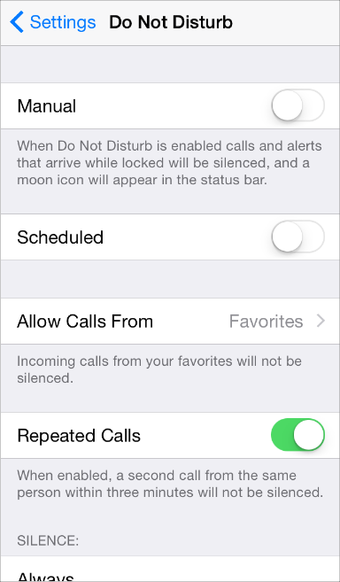

## 1.12 术语和措辞(Terminology and Wording)
你在应用中呈现的每一个字都是与用户进行对话的一部分。把握这样的对话机会，为你的用户提供清晰的表意与愉悦的体验。

设置是面向全体用户的一个基础应用，因此它使用了简明扼要的语言来描述用户可以进行的操作。举个例子，设置→勿扰模式(Do Not Disturb)就没有使用难以理解的复杂技术术语，而是用了简单的语言，给用户描述了里头的一系列操作。

**保证你使用的术语是用户能理解的。**根据你对用户群的理解来决定在应用中使用什么样的词汇。举个例子，在一款针对小白用户的应用中使用技术术语是不合适的，但对于针对高端用户的应用来说，使用技术术语是很自然的事情。

**使用非正式的友好语气，但不需要太过卑微。**避免太正式太僵化，或者太过嘻嘻哈哈，傲慢无礼。请记住，用户可能会反复阅读这些文本，因此有些起初看上去很俏皮的语句，多看几次之后可能会显得烦人。

**像新闻编辑一般遣词造句，避免不必要的冗余语句。**当你的文案足够简明扼要，用户就可以很轻松地阅读和理解它。确定最重要的信息，精炼它并且突出它，让用户不需要读一大段文字才能了解他们在找什么，以及下一步要做什么。

**给控件加上短标签或者容易理解的图标。**让用户只扫一眼就能知道这个控件是干什么的。

**描述时间时要注意准确性。**今天和明天这些词汇确实显得比较友好，但有时候会让用户费解，因为你可能没有办法确定用户当前的时区和时间。举个例子，假如有一项活动会在半夜12点前开始，对于在同一个时区的用户而言，这个活动是在今天开始的，但对于那些在早一点的时区里的用户而言，这个活动在昨天就已经开始了。

**为你的应用写一则漂亮的 App Store 描述，最大程度地把握住这个与潜在用户沟通的绝佳机会。**除了准确描述你的应用、强调应用的品质与亮点以外，你还需要：

- **修正所有的拼写、语法与标点符号错误。**这些小错误也许不会影响用户正常使用，但是可能会让他们对应用的整体品质产生负面印象。
- **尽量少用全大写的词汇。**虽然大写单词有时候可以吸引注意力，但是全大写的段落不适合阅读，而且会产生一种朝用户扯着嗓子吼的感觉。
- **可以描述 bug 修复情况。**如果您的应用新版包含用户一直期待的 bug 修复，那在你的软件描述中提到这一点就是个很好的做法。