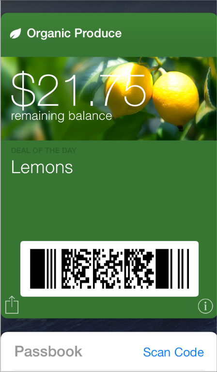
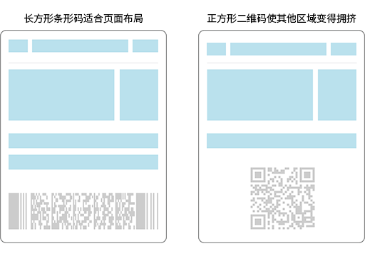

## 3.3 钱包(Wallet)
Wallet 应用是帮助用户查看和管理各种数字化票券的，他们是一些物理个体的数字展现，例如登机牌、优惠券、会员卡、奖励卡和各种票。Wallet 也可以让人们添加他们的信用卡、借记卡和储值卡结合 Apple Pay 使用。你可以在应用中创建一个票券，分发给用户，并且在有更改时进行更新。

使用 PassKit 框架可以方便地用自定义内容来收集一个票券和使用户票券库中的票券。(想要学习 Passbook 技术的核心概念和 PassKit 接口的使用方法，请参考 [Passbook Programming Guide](https://developer.apple.com/library/ios/documentation/userexperience/conceptual/PassKit_PG/Chapters/Introduction.html#//apple_ref/doc/uid/TP40012195)。)以下几点可以帮助你创建一个用户乐意保留并使用的票券。

设计一个在各个设备上呈现很好票券。当你选择一个票券的样式——比如登机牌，优惠券，票据，奖励卡或者通用的票券——你会获得一个特别的布局和一系列区域去处理(更加详细关于不同票券的样式，参看 [Pass Style Sets the Overall Visual Appearance](https://developer.apple.com/library/ios/documentation/UserExperience/Conceptual/PassKit_PG/Creating.html#//apple_ref/doc/uid/TP40012195-CH4-SW45))。这个系统在各个设备上合理展示你的票券，所以正确使用票券的区域是非常重要的。例如，在 Apple Watch 上，条状图(strip)和缩略图(thumbnail)图片是不显示的，所以你不希望把基本的信息放到这些元素里。更多 Apple Watch 票券的布局，参看 [Designing Passes for Apple Watch](https://developer.apple.com/library/ios/documentation/UserExperience/Conceptual/PassKit_PG/Creating.html#//apple_ref/doc/uid/TP40012195-CH4-SW25).

使用合适的票券区域展现文本。在你的票券中使用允许 VoiceOver 的用户获取票券中的所有信息的区域，保持你的票券外观的一致性。避免将文本嵌入图片或使用自定义的字体也是一个很好的方法，因为不是所有的图标会展示到所有的设备上，这样对用户来说阅读这样的文字会有困难。

**避免使用识别一个设备的语言。**你不能预料到哪些用户将会查看你的票据的设备，因此你不想使用可能在一个特别设备上不起作用的语言。比如，文字告诉用户“滑动去查看”内容，当这个发生在 Apple Watch 上将会不起作用。

**尽可能，不要只是简单复制已有的物理票券。**Wallet 已经建立了有美感的设计，票券也都配合这种设计以看起来更好。所以不要只是复制物理票券的外观，抓住这次机会设计一个符合 Wallet 组成和功能的干净简洁的票券样式。

**对放在票券正面的信息精挑细选。**用户期望扫一眼票券就能快速获得他们需要的信息，所以票券正面的信息应该是整洁且易读的。如果有用户可能会需要的额外信息，将它们放到票券的背面要比挤在正面好得多。注意，Apple Watch 上的票券没有背面。

**通常情况下，避免使用纯白色背景。**通常，一个好看的票券应该使用鲜艳的纯色背景或者使用强烈的，充满活力的图片作为背景。当然，在设计背景时还要确保内容的可读性。

**在商标文本区域显示你的公司名称。**所有票券的商标文本区域的文字都使用了统一的字体。为了避免和其他票券发生冲突，还是建议您在商标文本区域输入文字，不要使用自定义字体。

**使用白色的公司商标。**商标图片放置在票券左上角公司名称的旁边。最好提供一个白色的，单色的，不包含文字的商标。如果你想要增强商标的效果，又想要与文字风格匹配的话，可以增加一个在 y 轴方向上有1像素偏移，有1像素模糊和透明度为35%的黑色阴影效果。

**如果可以的话，使用矩形的条形码。**类似于 PDF417 这样的长方形条形码比正方形二维码更适合票券的布局。如下右图所示，正方形的二维码会使两边有空白区域并且会在垂直方向上使上下方内容变得拥挤。

**为性能去优化图片。**因为用户通常会通过电子邮件或者 Safari 接收票券，所以让下载的越快越好是非常重要的。为了提高用户体验，使用能满足视觉效果的最小的图片文件。

**在合适的时候更新票券以增强其效用。**即使一个票券代表的是一个并不会改变的物理实体，数字的票券也可以通过映射真实世界的一些事件来提供更好的用户体验。例如，当某个航班延误时你可以更新登机牌上的信息，这样用户就能够通过查看电子登机牌来获得当前的信息。